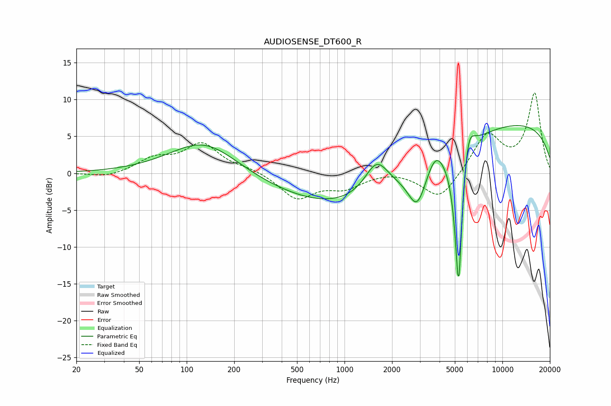

# AUDIOSENSE_DT600_R
See [usage instructions](https://github.com/jaakkopasanen/AutoEq#usage) for more options and info.

### Parametric EQs
Apply preamp of -6.6 dB when using parametric equalizer.

|   # | Type    |   Fc (Hz) |    Q |   Gain (dB) |
|-----|---------|-----------|------|-------------|
|   1 | Peaking |       130 | 0.65 |         4.9 |
|   2 | Peaking |       711 | 0.18 |        -1.4 |
|   3 | Peaking |      1577 | 0.28 |        -4.6 |
|   4 | Peaking |      1598 | 1.88 |         4.4 |
|   5 | Peaking |      2887 | 2.46 |        -5.1 |
|   6 | Peaking |      3774 | 2.66 |         2.6 |
|   7 | Peaking |      5240 | 4.41 |        -2.7 |
|   8 | Peaking |      5281 | 6    |       -18   |
|   9 | Peaking |      6065 | 3.65 |         4.7 |
|  10 | Peaking |      9051 | 0.18 |         7.3 |

### Fixed Band EQs
When using fixed band (also called graphic) equalizer, apply preamp of **-11.0 dB** (if available) and set gains manually with these parameters.

|   # | Type    |   Fc (Hz) |    Q |   Gain (dB) |
|-----|---------|-----------|------|-------------|
|   1 | Peaking |        31 | 1.41 |        -0.6 |
|   2 | Peaking |        62 | 1.41 |         1.8 |
|   3 | Peaking |       125 | 1.41 |         3.9 |
|   4 | Peaking |       250 | 1.41 |         0.5 |
|   5 | Peaking |       500 | 1.41 |        -3.4 |
|   6 | Peaking |      1000 | 1.41 |        -1.8 |
|   7 | Peaking |      2000 | 1.41 |         0.4 |
|   8 | Peaking |      4000 | 1.41 |        -3.7 |
|   9 | Peaking |      8000 | 1.41 |         5.3 |
|  10 | Peaking |     16000 | 1.41 |        10.7 |

### Graphs

