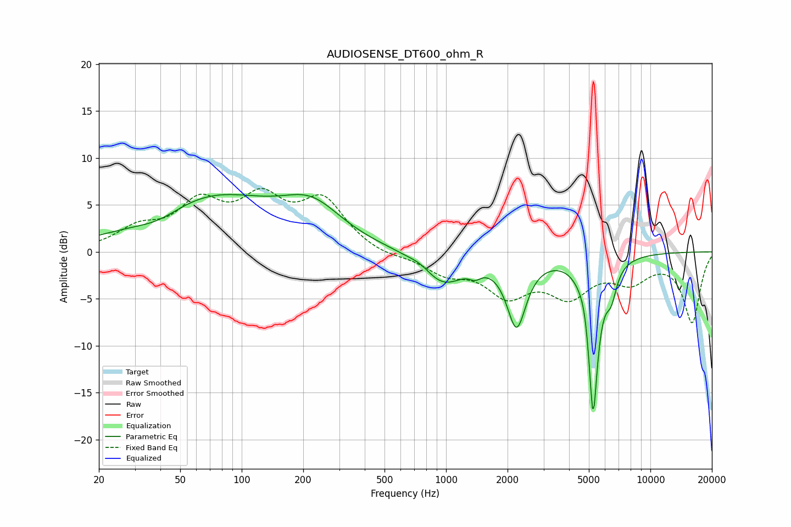

# AUDIOSENSE_DT600_ohm_R
See [usage instructions](https://github.com/jaakkopasanen/AutoEq#usage) for more options and info.

### Parametric EQs
Apply preamp of -6.2 dB when using parametric equalizer.

|   # | Type    |   Fc (Hz) |    Q |   Gain (dB) |
|-----|---------|-----------|------|-------------|
|   1 | Peaking |        39 | 1.17 |        -1.3 |
|   2 | Peaking |        69 | 0.43 |         5.9 |
|   3 | Peaking |       221 | 0.97 |         3.7 |
|   4 | Peaking |       751 | 3.14 |         0.4 |
|   5 | Peaking |       968 | 1.38 |        -3.3 |
|   6 | Peaking |      1388 | 5.22 |        -0.7 |
|   7 | Peaking |      2214 | 2.99 |        -7.4 |
|   8 | Peaking |      4783 | 6    |         1.2 |
|   9 | Peaking |      5244 | 5.54 |       -16.9 |
|  10 | Peaking |      6431 | 5.3  |        -2.7 |

### Fixed Band EQs
When using fixed band (also called graphic) equalizer, apply preamp of **-6.8 dB** (if available) and set gains manually with these parameters.

|   # | Type    |   Fc (Hz) |    Q |   Gain (dB) |
|-----|---------|-----------|------|-------------|
|   1 | Peaking |        31 | 1.41 |         2.1 |
|   2 | Peaking |        62 | 1.41 |         4.6 |
|   3 | Peaking |       125 | 1.41 |         4.9 |
|   4 | Peaking |       250 | 1.41 |         5.1 |
|   5 | Peaking |       500 | 1.41 |        -0.6 |
|   6 | Peaking |      1000 | 1.41 |        -2   |
|   7 | Peaking |      2000 | 1.41 |        -4.1 |
|   8 | Peaking |      4000 | 1.41 |        -4.1 |
|   9 | Peaking |      8000 | 1.41 |        -2.6 |
|  10 | Peaking |     16000 | 1.41 |        -7.4 |

### Graphs

