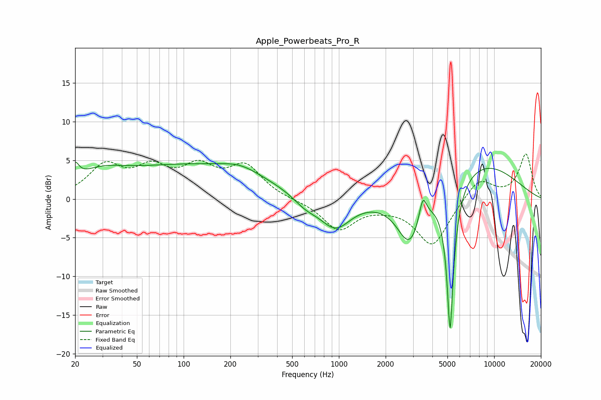

# Apple_Powerbeats_Pro_R
See [usage instructions](https://github.com/jaakkopasanen/AutoEq#usage) for more options and info.

### Parametric EQs
Apply preamp of -4.8 dB when using parametric equalizer.

|   # | Type    |   Fc (Hz) |    Q |   Gain (dB) |
|-----|---------|-----------|------|-------------|
|   1 | Peaking |        20 | 5.9  |         2   |
|   2 | Peaking |        28 | 0.86 |         2.2 |
|   3 | Peaking |       113 | 0.29 |         4.2 |
|   4 | Peaking |       233 | 1.17 |         1   |
|   5 | Peaking |       609 | 1.73 |        -1.3 |
|   6 | Peaking |       948 | 1.41 |        -3.9 |
|   7 | Peaking |      2857 | 1.74 |        -6.4 |
|   8 | Peaking |      3471 | 5.94 |         3.3 |
|   9 | Peaking |      5204 | 6    |       -19.6 |
|  10 | Peaking |      8097 | 0.51 |         4.8 |

### Fixed Band EQs
When using fixed band (also called graphic) equalizer, apply preamp of **-5.9 dB** (if available) and set gains manually with these parameters.

|   # | Type    |   Fc (Hz) |    Q |   Gain (dB) |
|-----|---------|-----------|------|-------------|
|   1 | Peaking |        31 | 1.41 |         4   |
|   2 | Peaking |        62 | 1.41 |         3.4 |
|   3 | Peaking |       125 | 1.41 |         3.5 |
|   4 | Peaking |       250 | 1.41 |         4   |
|   5 | Peaking |       500 | 1.41 |        -0.1 |
|   6 | Peaking |      1000 | 1.41 |        -3.9 |
|   7 | Peaking |      2000 | 1.41 |        -0.5 |
|   8 | Peaking |      4000 | 1.41 |        -6.1 |
|   9 | Peaking |      8000 | 1.41 |         2.8 |
|  10 | Peaking |     16000 | 1.41 |         5.8 |

### Graphs

