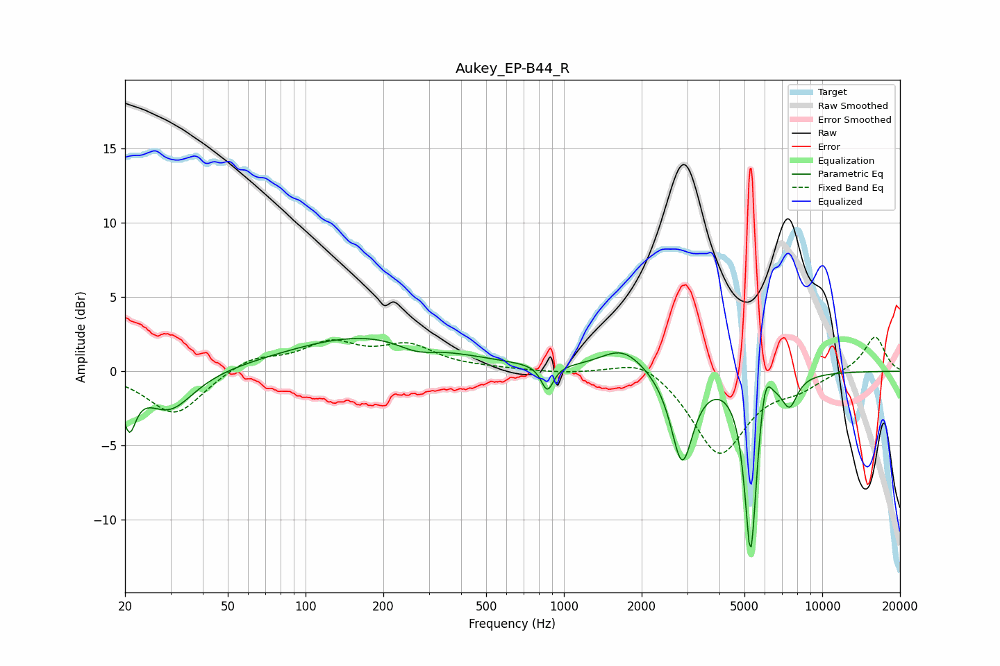

# Aukey_EP-B44_R
See [usage instructions](https://github.com/jaakkopasanen/AutoEq#usage) for more options and info.

### Parametric EQs
Apply preamp of -2.3 dB when using parametric equalizer.

|   # | Type    |   Fc (Hz) |    Q |   Gain (dB) |
|-----|---------|-----------|------|-------------|
|   1 | Peaking |        21 | 5.63 |        -3   |
|   2 | Peaking |        30 | 1.51 |        -2.7 |
|   3 | Peaking |       174 | 0.47 |         2.4 |
|   4 | Peaking |       269 | 1.9  |        -0.7 |
|   5 | Peaking |       863 | 6    |        -1.8 |
|   6 | Peaking |      1690 | 1.65 |         1.6 |
|   7 | Peaking |      2868 | 3.37 |        -6.1 |
|   8 | Peaking |      5285 | 5.83 |       -12.3 |
|   9 | Peaking |      6002 | 6    |         2.5 |
|  10 | Peaking |      7474 | 4.42 |        -1.9 |

### Fixed Band EQs
When using fixed band (also called graphic) equalizer, apply preamp of **-2.4 dB** (if available) and set gains manually with these parameters.

|   # | Type    |   Fc (Hz) |    Q |   Gain (dB) |
|-----|---------|-----------|------|-------------|
|   1 | Peaking |        31 | 1.41 |        -3   |
|   2 | Peaking |        62 | 1.41 |         1   |
|   3 | Peaking |       125 | 1.41 |         1.7 |
|   4 | Peaking |       250 | 1.41 |         1.6 |
|   5 | Peaking |       500 | 1.41 |         0.1 |
|   6 | Peaking |      1000 | 1.41 |        -0.1 |
|   7 | Peaking |      2000 | 1.41 |         1.1 |
|   8 | Peaking |      4000 | 1.41 |        -5.6 |
|   9 | Peaking |      8000 | 1.41 |        -0.9 |
|  10 | Peaking |     16000 | 1.41 |         2.4 |

### Graphs

