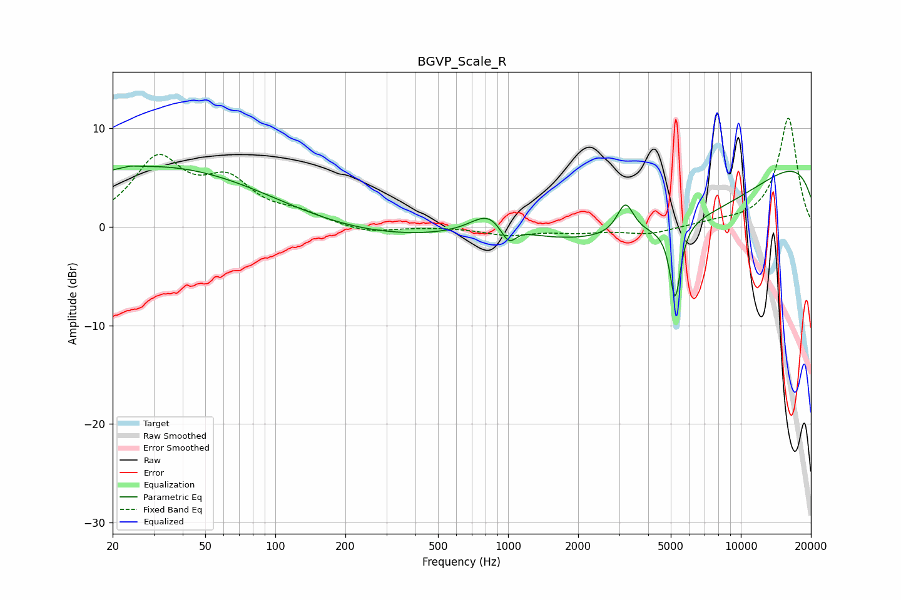

# BGVP_Scale_R
See [usage instructions](https://github.com/jaakkopasanen/AutoEq#usage) for more options and info.

### Parametric EQs
Apply preamp of -6.3 dB when using parametric equalizer.

|   # | Type    |   Fc (Hz) |    Q |   Gain (dB) |
|-----|---------|-----------|------|-------------|
|   1 | Peaking |        24 | 5.32 |         0.2 |
|   2 | Peaking |        33 | 0.27 |         6.4 |
|   3 | Peaking |       189 | 0.34 |        -1.6 |
|   4 | Peaking |       836 | 1.76 |         2.5 |
|   5 | Peaking |      1007 | 3.78 |        -2.2 |
|   6 | Peaking |      1108 | 3.19 |         0.4 |
|   7 | Peaking |      3192 | 3.96 |         3.2 |
|   8 | Peaking |      5082 | 0.28 |        -8.1 |
|   9 | Peaking |      5223 | 6    |        -7.6 |
|  10 | Peaking |     10000 | 0.18 |         9.4 |

### Fixed Band EQs
When using fixed band (also called graphic) equalizer, apply preamp of **-11.1 dB** (if available) and set gains manually with these parameters.

|   # | Type    |   Fc (Hz) |    Q |   Gain (dB) |
|-----|---------|-----------|------|-------------|
|   1 | Peaking |        31 | 1.41 |         6.5 |
|   2 | Peaking |        62 | 1.41 |         4.1 |
|   3 | Peaking |       125 | 1.41 |         1.1 |
|   4 | Peaking |       250 | 1.41 |        -0.7 |
|   5 | Peaking |       500 | 1.41 |         0   |
|   6 | Peaking |      1000 | 1.41 |        -0.8 |
|   7 | Peaking |      2000 | 1.41 |        -0.5 |
|   8 | Peaking |      4000 | 1.41 |        -0.8 |
|   9 | Peaking |      8000 | 1.41 |         0.3 |
|  10 | Peaking |     16000 | 1.41 |        11.1 |

### Graphs

