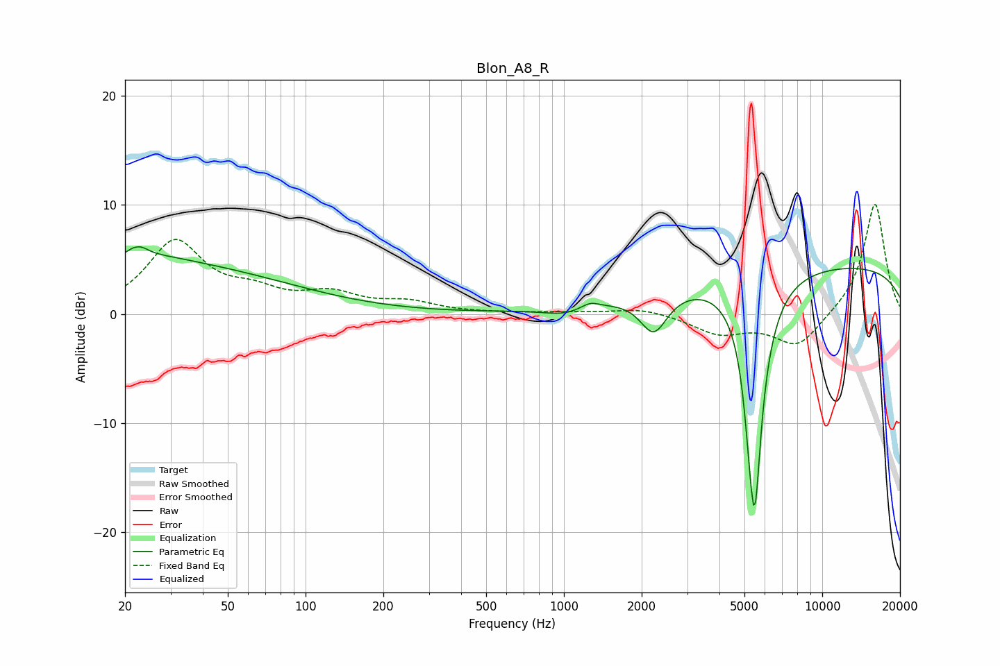

# Blon_A8_R
See [usage instructions](https://github.com/jaakkopasanen/AutoEq#usage) for more options and info.

### Parametric EQs
Apply preamp of -6.2 dB when using parametric equalizer.

|   # | Type    |   Fc (Hz) |    Q |   Gain (dB) |
|-----|---------|-----------|------|-------------|
|   1 | Peaking |        22 | 5.9  |        -2.7 |
|   2 | Peaking |        22 | 5.23 |         3.7 |
|   3 | Peaking |        25 | 0.26 |         4.5 |
|   4 | Peaking |        25 | 0.97 |         0.7 |
|   5 | Peaking |      1013 | 1.7  |        -0.7 |
|   6 | Peaking |      1261 | 3.93 |         0.6 |
|   7 | Peaking |      2229 | 2.69 |        -3.6 |
|   8 | Peaking |      5272 | 6    |        -4.1 |
|   9 | Peaking |      5492 | 4.28 |       -18.5 |
|  10 | Peaking |      9855 | 0.18 |         4.5 |

### Fixed Band EQs
When using fixed band (also called graphic) equalizer, apply preamp of **-10.1 dB** (if available) and set gains manually with these parameters.

|   # | Type    |   Fc (Hz) |    Q |   Gain (dB) |
|-----|---------|-----------|------|-------------|
|   1 | Peaking |        31 | 1.41 |         6.5 |
|   2 | Peaking |        62 | 1.41 |         1.6 |
|   3 | Peaking |       125 | 1.41 |         1.6 |
|   4 | Peaking |       250 | 1.41 |         0.9 |
|   5 | Peaking |       500 | 1.41 |         0   |
|   6 | Peaking |      1000 | 1.41 |         0.1 |
|   7 | Peaking |      2000 | 1.41 |         0.6 |
|   8 | Peaking |      4000 | 1.41 |        -1.7 |
|   9 | Peaking |      8000 | 1.41 |        -3.1 |
|  10 | Peaking |     16000 | 1.41 |        10.3 |

### Graphs

