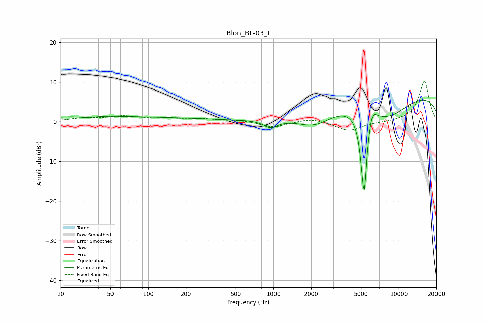

# Blon_BL-03_L
See [usage instructions](https://github.com/jaakkopasanen/AutoEq#usage) for more options and info.

### Parametric EQs
Apply preamp of -5.5 dB when using parametric equalizer.

|   # | Type    |   Fc (Hz) |    Q |   Gain (dB) |
|-----|---------|-----------|------|-------------|
|   1 | Peaking |        28 | 0.58 |         0.9 |
|   2 | Peaking |        32 | 1.93 |        -0.5 |
|   3 | Peaking |        92 | 0.26 |         1   |
|   4 | Peaking |       950 | 2.48 |        -1.8 |
|   5 | Peaking |      2136 | 1.01 |        -3.7 |
|   6 | Peaking |      5155 | 5.79 |        -4.8 |
|   7 | Peaking |      5310 | 5.84 |       -17.7 |
|   8 | Peaking |      6112 | 4.2  |         4   |
|   9 | Peaking |      8343 | 0.78 |        -5.2 |
|  10 | Peaking |     10000 | 0.18 |         7.3 |

### Fixed Band EQs
When using fixed band (also called graphic) equalizer, apply preamp of **-10.3 dB** (if available) and set gains manually with these parameters.

|   # | Type    |   Fc (Hz) |    Q |   Gain (dB) |
|-----|---------|-----------|------|-------------|
|   1 | Peaking |        31 | 1.41 |         0.8 |
|   2 | Peaking |        62 | 1.41 |         1.2 |
|   3 | Peaking |       125 | 1.41 |         0.8 |
|   4 | Peaking |       250 | 1.41 |         0.7 |
|   5 | Peaking |       500 | 1.41 |         0.4 |
|   6 | Peaking |      1000 | 1.41 |        -1.4 |
|   7 | Peaking |      2000 | 1.41 |         0.9 |
|   8 | Peaking |      4000 | 1.41 |        -2.3 |
|   9 | Peaking |      8000 | 1.41 |        -0.2 |
|  10 | Peaking |     16000 | 1.41 |        10.3 |

### Graphs

