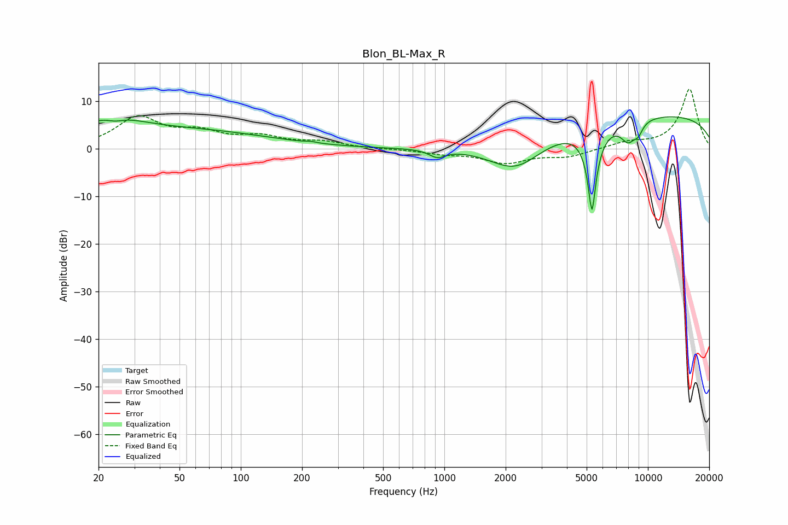

# Blon_BL-Max_R
See [usage instructions](https://github.com/jaakkopasanen/AutoEq#usage) for more options and info.

### Parametric EQs
Apply preamp of -6.8 dB when using parametric equalizer.

|   # | Type    |   Fc (Hz) |    Q |   Gain (dB) |
|-----|---------|-----------|------|-------------|
|   1 | Peaking |        22 | 0.73 |         5.2 |
|   2 | Peaking |        24 | 4.09 |        -0.7 |
|   3 | Peaking |        71 | 0.43 |         3.1 |
|   4 | Peaking |       221 | 5.58 |         0.2 |
|   5 | Peaking |       922 | 3.63 |        -1.6 |
|   6 | Peaking |      2244 | 1.01 |        -7.1 |
|   7 | Peaking |      5311 | 6    |       -17.7 |
|   8 | Peaking |      8012 | 3.48 |        -4.1 |
|   9 | Peaking |      8971 | 5.73 |        -2   |
|  10 | Peaking |     10000 | 0.19 |         7.3 |

### Fixed Band EQs
When using fixed band (also called graphic) equalizer, apply preamp of **-12.7 dB** (if available) and set gains manually with these parameters.

|   # | Type    |   Fc (Hz) |    Q |   Gain (dB) |
|-----|---------|-----------|------|-------------|
|   1 | Peaking |        31 | 1.41 |         6.4 |
|   2 | Peaking |        62 | 1.41 |         2.9 |
|   3 | Peaking |       125 | 1.41 |         2.2 |
|   4 | Peaking |       250 | 1.41 |         1.3 |
|   5 | Peaking |       500 | 1.41 |        -0   |
|   6 | Peaking |      1000 | 1.41 |        -0.8 |
|   7 | Peaking |      2000 | 1.41 |        -2.8 |
|   8 | Peaking |      4000 | 1.41 |        -1.5 |
|   9 | Peaking |      8000 | 1.41 |         1.2 |
|  10 | Peaking |     16000 | 1.41 |        12.6 |

### Graphs

