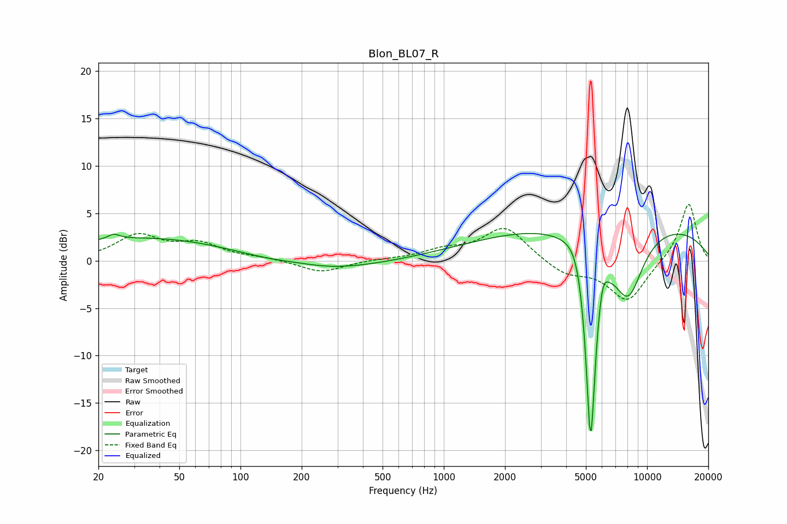

# Blon_BL07_R
See [usage instructions](https://github.com/jaakkopasanen/AutoEq#usage) for more options and info.

### Parametric EQs
Apply preamp of -3.0 dB when using parametric equalizer.

|   # | Type    |   Fc (Hz) |    Q |   Gain (dB) |
|-----|---------|-----------|------|-------------|
|   1 | Peaking |        24 | 4.98 |         0.5 |
|   2 | Peaking |        37 | 0.31 |         2.5 |
|   3 | Peaking |       190 | 1.15 |         0.4 |
|   4 | Peaking |       221 | 0.49 |        -1.4 |
|   5 | Peaking |      4573 | 2.64 |         2.2 |
|   6 | Peaking |      5269 | 5.16 |       -18.6 |
|   7 | Peaking |      5293 | 5.93 |        -4   |
|   8 | Peaking |      6036 | 5.79 |         2.3 |
|   9 | Peaking |      6944 | 0.18 |         4.3 |
|  10 | Peaking |      8066 | 1.69 |        -7   |

### Fixed Band EQs
When using fixed band (also called graphic) equalizer, apply preamp of **-6.0 dB** (if available) and set gains manually with these parameters.

|   # | Type    |   Fc (Hz) |    Q |   Gain (dB) |
|-----|---------|-----------|------|-------------|
|   1 | Peaking |        31 | 1.41 |         2.6 |
|   2 | Peaking |        62 | 1.41 |         1.6 |
|   3 | Peaking |       125 | 1.41 |         0.3 |
|   4 | Peaking |       250 | 1.41 |        -1.3 |
|   5 | Peaking |       500 | 1.41 |         0.1 |
|   6 | Peaking |      1000 | 1.41 |         1   |
|   7 | Peaking |      2000 | 1.41 |         3.6 |
|   8 | Peaking |      4000 | 1.41 |        -1.4 |
|   9 | Peaking |      8000 | 1.41 |        -4.3 |
|  10 | Peaking |     16000 | 1.41 |         6.2 |

### Graphs

