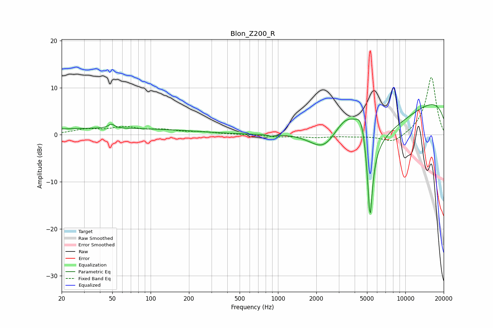

# Blon_Z200_R
See [usage instructions](https://github.com/jaakkopasanen/AutoEq#usage) for more options and info.

### Parametric EQs
Apply preamp of -6.5 dB when using parametric equalizer.

|   # | Type    |   Fc (Hz) |    Q |   Gain (dB) |
|-----|---------|-----------|------|-------------|
|   1 | Peaking |        44 | 0.18 |         1.4 |
|   2 | Peaking |        49 | 6    |         0.9 |
|   3 | Peaking |       888 | 5.51 |        -0.3 |
|   4 | Peaking |      2293 | 1.19 |        -5.5 |
|   5 | Peaking |      2990 | 0.96 |        -3   |
|   6 | Peaking |      3444 | 0.77 |        14   |
|   7 | Peaking |      4542 | 3.38 |         5.7 |
|   8 | Peaking |      5053 | 0.45 |       -15.8 |
|   9 | Peaking |      5279 | 6    |       -20   |
|  10 | Peaking |     10000 | 0.18 |        10.4 |

### Fixed Band EQs
When using fixed band (also called graphic) equalizer, apply preamp of **-12.3 dB** (if available) and set gains manually with these parameters.

|   # | Type    |   Fc (Hz) |    Q |   Gain (dB) |
|-----|---------|-----------|------|-------------|
|   1 | Peaking |        31 | 1.41 |         1   |
|   2 | Peaking |        62 | 1.41 |         1.4 |
|   3 | Peaking |       125 | 1.41 |         0.9 |
|   4 | Peaking |       250 | 1.41 |         0.5 |
|   5 | Peaking |       500 | 1.41 |         0.1 |
|   6 | Peaking |      1000 | 1.41 |        -0.4 |
|   7 | Peaking |      2000 | 1.41 |        -0.5 |
|   8 | Peaking |      4000 | 1.41 |        -0.3 |
|   9 | Peaking |      8000 | 1.41 |        -1.9 |
|  10 | Peaking |     16000 | 1.41 |        12.4 |

### Graphs

