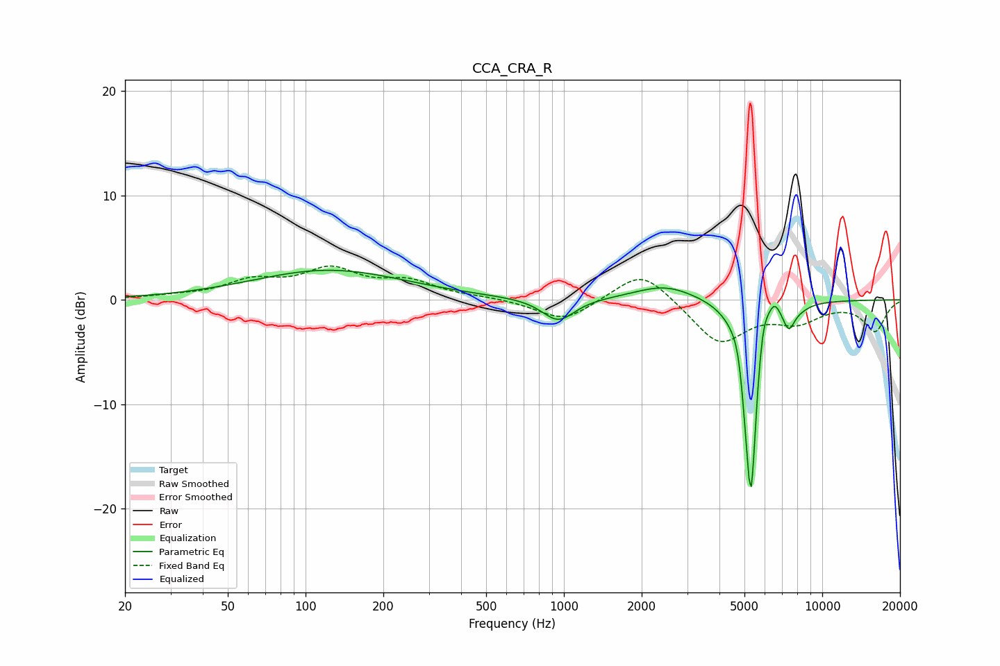

# CCA_CRA_R
See [usage instructions](https://github.com/jaakkopasanen/AutoEq#usage) for more options and info.

### Parametric EQs
Apply preamp of -2.9 dB when using parametric equalizer.

|   # | Type    |   Fc (Hz) |    Q |   Gain (dB) |
|-----|---------|-----------|------|-------------|
|   1 | Peaking |       123 | 0.48 |         2.8 |
|   2 | Peaking |       951 | 2.27 |        -2.2 |
|   3 | Peaking |      2468 | 1.19 |         1.5 |
|   4 | Peaking |      4745 | 5.97 |         1.6 |
|   5 | Peaking |      5126 | 6    |        -3.5 |
|   6 | Peaking |      5308 | 5.72 |       -17.3 |
|   7 | Peaking |      5887 | 5.81 |         3.3 |
|   8 | Peaking |      6517 | 5.47 |         1.8 |
|   9 | Peaking |      7429 | 5.86 |        -2.1 |
|  10 | Peaking |      8295 | 3.84 |        -0.3 |

### Fixed Band EQs
When using fixed band (also called graphic) equalizer, apply preamp of **-3.3 dB** (if available) and set gains manually with these parameters.

|   # | Type    |   Fc (Hz) |    Q |   Gain (dB) |
|-----|---------|-----------|------|-------------|
|   1 | Peaking |        31 | 1.41 |         0.3 |
|   2 | Peaking |        62 | 1.41 |         1.6 |
|   3 | Peaking |       125 | 1.41 |         2.7 |
|   4 | Peaking |       250 | 1.41 |         1.6 |
|   5 | Peaking |       500 | 1.41 |         0.2 |
|   6 | Peaking |      1000 | 1.41 |        -2.1 |
|   7 | Peaking |      2000 | 1.41 |         3.1 |
|   8 | Peaking |      4000 | 1.41 |        -4.2 |
|   9 | Peaking |      8000 | 1.41 |        -1.8 |
|  10 | Peaking |     16000 | 1.41 |        -2.9 |

### Graphs

