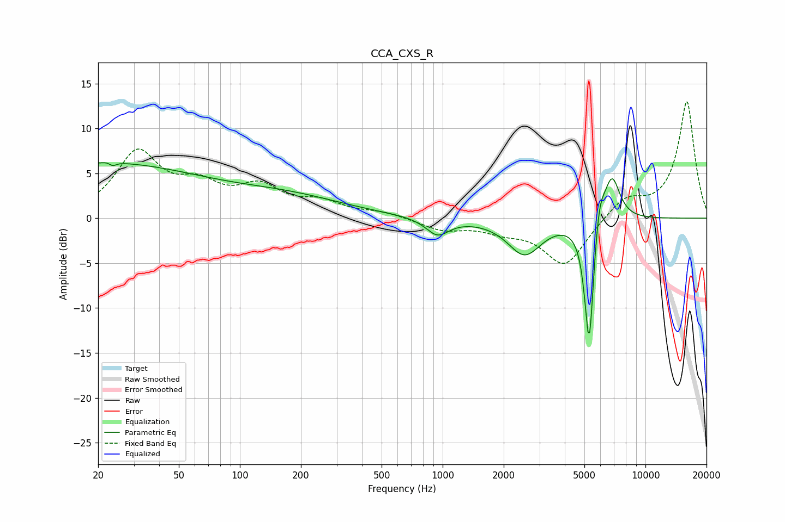

# CCA_CXS_R
See [usage instructions](https://github.com/jaakkopasanen/AutoEq#usage) for more options and info.

### Parametric EQs
Apply preamp of -6.3 dB when using parametric equalizer.

|   # | Type    |   Fc (Hz) |    Q |   Gain (dB) |
|-----|---------|-----------|------|-------------|
|   1 | Peaking |        21 | 0.27 |         6   |
|   2 | Peaking |        23 | 5.55 |         3.2 |
|   3 | Peaking |        23 | 6    |        -3.4 |
|   4 | Peaking |       173 | 0.49 |         2   |
|   5 | Peaking |       943 | 2.49 |        -1.9 |
|   6 | Peaking |      2536 | 1.7  |        -4   |
|   7 | Peaking |      5228 | 6    |        -2.1 |
|   8 | Peaking |      5287 | 5.99 |       -12.9 |
|   9 | Peaking |      5914 | 5.22 |         3.6 |
|  10 | Peaking |      6839 | 3.44 |         5.1 |

### Fixed Band EQs
When using fixed band (also called graphic) equalizer, apply preamp of **-13.1 dB** (if available) and set gains manually with these parameters.

|   # | Type    |   Fc (Hz) |    Q |   Gain (dB) |
|-----|---------|-----------|------|-------------|
|   1 | Peaking |        31 | 1.41 |         7   |
|   2 | Peaking |        62 | 1.41 |         2.9 |
|   3 | Peaking |       125 | 1.41 |         3   |
|   4 | Peaking |       250 | 1.41 |         1.5 |
|   5 | Peaking |       500 | 1.41 |         0.6 |
|   6 | Peaking |      1000 | 1.41 |        -1.2 |
|   7 | Peaking |      2000 | 1.41 |        -1.1 |
|   8 | Peaking |      4000 | 1.41 |        -5.3 |
|   9 | Peaking |      8000 | 1.41 |         2.2 |
|  10 | Peaking |     16000 | 1.41 |        13   |

### Graphs

