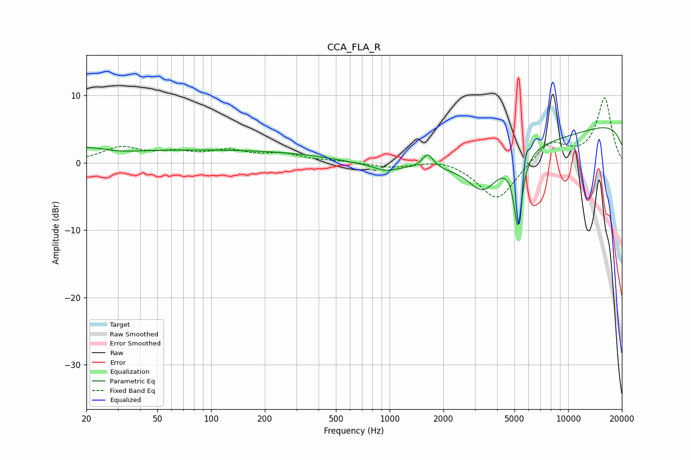

# CCA_FLA_R
See [usage instructions](https://github.com/jaakkopasanen/AutoEq#usage) for more options and info.

### Parametric EQs
Apply preamp of -5.3 dB when using parametric equalizer.

|   # | Type    |   Fc (Hz) |    Q |   Gain (dB) |
|-----|---------|-----------|------|-------------|
|   1 | Peaking |        21 | 0.8  |         2.1 |
|   2 | Peaking |        28 | 1.11 |        -0.9 |
|   3 | Peaking |       133 | 0.18 |         1.9 |
|   4 | Peaking |       943 | 2.61 |        -0.7 |
|   5 | Peaking |      1136 | 0.91 |         0.5 |
|   6 | Peaking |      1634 | 4.46 |         2.2 |
|   7 | Peaking |      3341 | 1.64 |        -5   |
|   8 | Peaking |      4339 | 0.19 |        -4.9 |
|   9 | Peaking |      5228 | 6    |       -10.6 |
|  10 | Peaking |     10000 | 0.18 |         8.4 |

### Fixed Band EQs
When using fixed band (also called graphic) equalizer, apply preamp of **-9.7 dB** (if available) and set gains manually with these parameters.

|   # | Type    |   Fc (Hz) |    Q |   Gain (dB) |
|-----|---------|-----------|------|-------------|
|   1 | Peaking |        31 | 1.41 |         2.1 |
|   2 | Peaking |        62 | 1.41 |         1.2 |
|   3 | Peaking |       125 | 1.41 |         1.5 |
|   4 | Peaking |       250 | 1.41 |         1.1 |
|   5 | Peaking |       500 | 1.41 |         0.2 |
|   6 | Peaking |      1000 | 1.41 |        -0.7 |
|   7 | Peaking |      2000 | 1.41 |         0.7 |
|   8 | Peaking |      4000 | 1.41 |        -5.7 |
|   9 | Peaking |      8000 | 1.41 |         3.2 |
|  10 | Peaking |     16000 | 1.41 |         9.6 |

### Graphs

