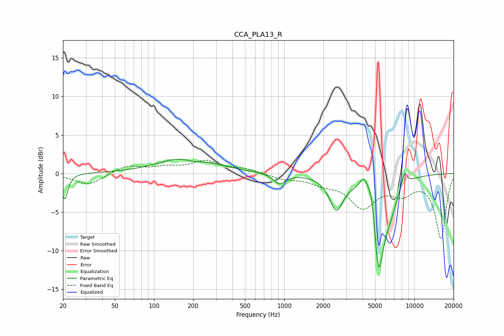

# CCA_PLA13_R
See [usage instructions](https://github.com/jaakkopasanen/AutoEq#usage) for more options and info.

### Parametric EQs
Apply preamp of -1.9 dB when using parametric equalizer.

|   # | Type    |   Fc (Hz) |    Q |   Gain (dB) |
|-----|---------|-----------|------|-------------|
|   1 | Peaking |        21 | 5.94 |        -3.4 |
|   2 | Peaking |       181 | 0.7  |         2.3 |
|   3 | Peaking |       202 | 1.86 |        -0.7 |
|   4 | Peaking |       921 | 3.11 |        -1.4 |
|   5 | Peaking |      2514 | 2.69 |        -4.3 |
|   6 | Peaking |      4072 | 4.5  |         2.2 |
|   7 | Peaking |      4723 | 4.12 |         4.8 |
|   8 | Peaking |      5284 | 2.97 |       -13.8 |
|   9 | Peaking |      6581 | 2.92 |        -2.1 |
|  10 | Peaking |      8386 | 6    |         1.8 |

### Fixed Band EQs
When using fixed band (also called graphic) equalizer, apply preamp of **-1.8 dB** (if available) and set gains manually with these parameters.

|   # | Type    |   Fc (Hz) |    Q |   Gain (dB) |
|-----|---------|-----------|------|-------------|
|   1 | Peaking |        31 | 1.41 |        -1.5 |
|   2 | Peaking |        62 | 1.41 |         1   |
|   3 | Peaking |       125 | 1.41 |         0.7 |
|   4 | Peaking |       250 | 1.41 |         1.5 |
|   5 | Peaking |       500 | 1.41 |         0.5 |
|   6 | Peaking |      1000 | 1.41 |        -0.6 |
|   7 | Peaking |      2000 | 1.41 |        -1   |
|   8 | Peaking |      4000 | 1.41 |        -4.1 |
|   9 | Peaking |      8000 | 1.41 |        -2.2 |
|  10 | Peaking |     16000 | 1.41 |        -8.4 |

### Graphs

