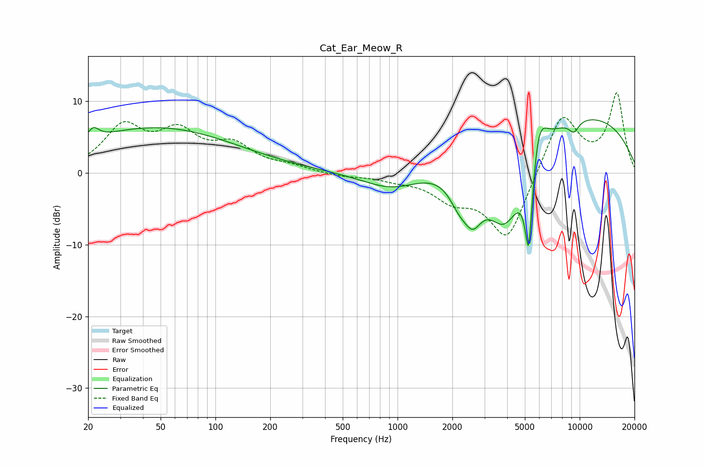

# Cat_Ear_Meow_R
See [usage instructions](https://github.com/jaakkopasanen/AutoEq#usage) for more options and info.

### Parametric EQs
Apply preamp of -7.5 dB when using parametric equalizer.

|   # | Type    |   Fc (Hz) |    Q |   Gain (dB) |
|-----|---------|-----------|------|-------------|
|   1 | Peaking |        21 | 4.77 |         1.5 |
|   2 | Peaking |        47 | 0.31 |         6.3 |
|   3 | Peaking |       948 | 0.84 |        -2.9 |
|   4 | Peaking |      2179 | 2.45 |        -3.2 |
|   5 | Peaking |      2590 | 2.74 |        -4.7 |
|   6 | Peaking |      3885 | 1.1  |       -13.3 |
|   7 | Peaking |      5252 | 6    |       -13.6 |
|   8 | Peaking |      5934 | 3.07 |         6.3 |
|   9 | Peaking |      7840 | 0.23 |         9.3 |
|  10 | Peaking |      9293 | 4.57 |        -1.5 |

### Fixed Band EQs
When using fixed band (also called graphic) equalizer, apply preamp of **-11.2 dB** (if available) and set gains manually with these parameters.

|   # | Type    |   Fc (Hz) |    Q |   Gain (dB) |
|-----|---------|-----------|------|-------------|
|   1 | Peaking |        31 | 1.41 |         6.1 |
|   2 | Peaking |        62 | 1.41 |         4.9 |
|   3 | Peaking |       125 | 1.41 |         3.4 |
|   4 | Peaking |       250 | 1.41 |         0.7 |
|   5 | Peaking |       500 | 1.41 |        -0.5 |
|   6 | Peaking |      1000 | 1.41 |        -0.7 |
|   7 | Peaking |      2000 | 1.41 |        -3.1 |
|   8 | Peaking |      4000 | 1.41 |        -9.5 |
|   9 | Peaking |      8000 | 1.41 |         8.6 |
|  10 | Peaking |     16000 | 1.41 |        10.9 |

### Graphs

