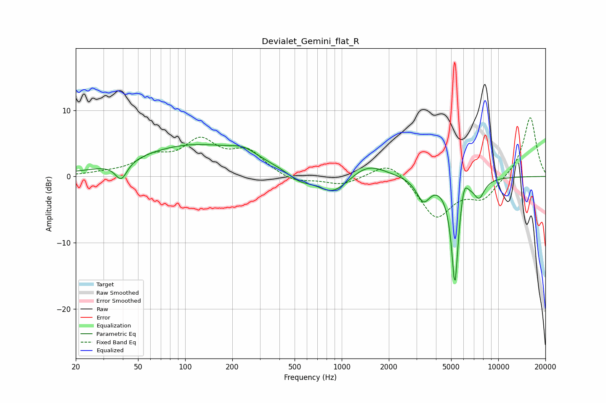

# Devialet_Gemini_flat_R
See [usage instructions](https://github.com/jaakkopasanen/AutoEq#usage) for more options and info.

### Parametric EQs
Apply preamp of -4.9 dB when using parametric equalizer.

|   # | Type    |   Fc (Hz) |    Q |   Gain (dB) |
|-----|---------|-----------|------|-------------|
|   1 | Peaking |        39 | 3.73 |        -2.7 |
|   2 | Peaking |       113 | 0.38 |         4.7 |
|   3 | Peaking |       236 | 1.69 |         1.2 |
|   4 | Peaking |       535 | 1.93 |        -1.2 |
|   5 | Peaking |       878 | 1.41 |        -3.1 |
|   6 | Peaking |      1469 | 1.27 |         2.1 |
|   7 | Peaking |      3325 | 3.22 |        -3.4 |
|   8 | Peaking |      5283 | 6    |       -16.3 |
|   9 | Peaking |      6040 | 5.99 |         2.9 |
|  10 | Peaking |      7553 | 3.93 |        -2.6 |

### Fixed Band EQs
When using fixed band (also called graphic) equalizer, apply preamp of **-9.0 dB** (if available) and set gains manually with these parameters.

|   # | Type    |   Fc (Hz) |    Q |   Gain (dB) |
|-----|---------|-----------|------|-------------|
|   1 | Peaking |        31 | 1.41 |         0.3 |
|   2 | Peaking |        62 | 1.41 |         2.5 |
|   3 | Peaking |       125 | 1.41 |         4.9 |
|   4 | Peaking |       250 | 1.41 |         3.5 |
|   5 | Peaking |       500 | 1.41 |        -1.1 |
|   6 | Peaking |      1000 | 1.41 |        -1.3 |
|   7 | Peaking |      2000 | 1.41 |         2.6 |
|   8 | Peaking |      4000 | 1.41 |        -6.2 |
|   9 | Peaking |      8000 | 1.41 |        -3.1 |
|  10 | Peaking |     16000 | 1.41 |         9.1 |

### Graphs

