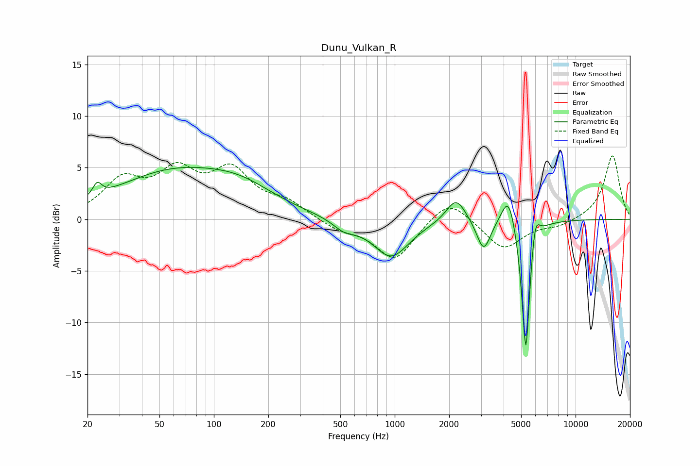

# Dunu_Vulkan_R
See [usage instructions](https://github.com/jaakkopasanen/AutoEq#usage) for more options and info.

### Parametric EQs
Apply preamp of -5.1 dB when using parametric equalizer.

|   # | Type    |   Fc (Hz) |    Q |   Gain (dB) |
|-----|---------|-----------|------|-------------|
|   1 | Peaking |        23 | 5.84 |         1.2 |
|   2 | Peaking |        60 | 0.43 |         4.4 |
|   3 | Peaking |       143 | 0.76 |         1.7 |
|   4 | Peaking |       527 | 2.26 |        -0.9 |
|   5 | Peaking |       954 | 1.42 |        -3.7 |
|   6 | Peaking |      2185 | 2.61 |         2.4 |
|   7 | Peaking |      3102 | 3.71 |        -3.1 |
|   8 | Peaking |      4262 | 3.61 |         3.3 |
|   9 | Peaking |      5309 | 6    |       -13.8 |
|  10 | Peaking |      5972 | 6    |         2.9 |

### Fixed Band EQs
When using fixed band (also called graphic) equalizer, apply preamp of **-6.2 dB** (if available) and set gains manually with these parameters.

|   # | Type    |   Fc (Hz) |    Q |   Gain (dB) |
|-----|---------|-----------|------|-------------|
|   1 | Peaking |        31 | 1.41 |         3.5 |
|   2 | Peaking |        62 | 1.41 |         4   |
|   3 | Peaking |       125 | 1.41 |         4.3 |
|   4 | Peaking |       250 | 1.41 |         1.4 |
|   5 | Peaking |       500 | 1.41 |        -0.9 |
|   6 | Peaking |      1000 | 1.41 |        -3.9 |
|   7 | Peaking |      2000 | 1.41 |         2.3 |
|   8 | Peaking |      4000 | 1.41 |        -2.9 |
|   9 | Peaking |      8000 | 1.41 |        -0.6 |
|  10 | Peaking |     16000 | 1.41 |         6.2 |

### Graphs

