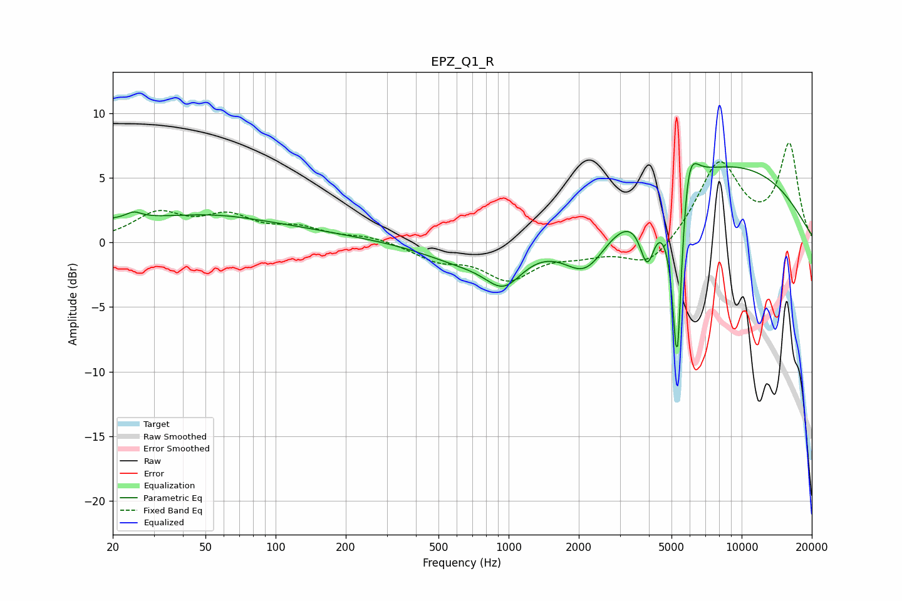

# EPZ_Q1_R
See [usage instructions](https://github.com/jaakkopasanen/AutoEq#usage) for more options and info.

### Parametric EQs
Apply preamp of -6.2 dB when using parametric equalizer.

|   # | Type    |   Fc (Hz) |    Q |   Gain (dB) |
|-----|---------|-----------|------|-------------|
|   1 | Peaking |        25 | 4.46 |         0.5 |
|   2 | Peaking |        33 | 0.2  |         1.8 |
|   3 | Peaking |        55 | 0.82 |         0.4 |
|   4 | Peaking |       618 | 0.86 |        -1.3 |
|   5 | Peaking |       953 | 1.71 |        -2.8 |
|   6 | Peaking |      2143 | 1.45 |        -3.7 |
|   7 | Peaking |      3936 | 4.31 |        -4.1 |
|   8 | Peaking |      5288 | 6    |       -16.1 |
|   9 | Peaking |      5859 | 3.61 |         5.3 |
|  10 | Peaking |      8259 | 0.31 |         6.1 |

### Fixed Band EQs
When using fixed band (also called graphic) equalizer, apply preamp of **-7.8 dB** (if available) and set gains manually with these parameters.

|   # | Type    |   Fc (Hz) |    Q |   Gain (dB) |
|-----|---------|-----------|------|-------------|
|   1 | Peaking |        31 | 1.41 |         2.1 |
|   2 | Peaking |        62 | 1.41 |         1.8 |
|   3 | Peaking |       125 | 1.41 |         1   |
|   4 | Peaking |       250 | 1.41 |         0.5 |
|   5 | Peaking |       500 | 1.41 |        -1.2 |
|   6 | Peaking |      1000 | 1.41 |        -2.6 |
|   7 | Peaking |      2000 | 1.41 |        -0.7 |
|   8 | Peaking |      4000 | 1.41 |        -2   |
|   9 | Peaking |      8000 | 1.41 |         6.2 |
|  10 | Peaking |     16000 | 1.41 |         7.4 |

### Graphs

