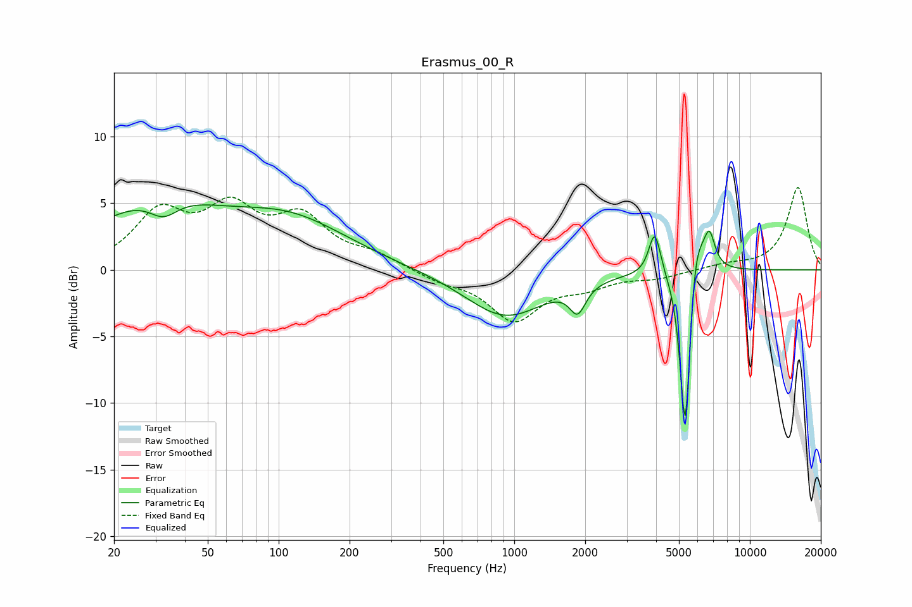

# Erasmus_00_R
See [usage instructions](https://github.com/jaakkopasanen/AutoEq#usage) for more options and info.

### Parametric EQs
Apply preamp of -5.0 dB when using parametric equalizer.

|   # | Type    |   Fc (Hz) |    Q |   Gain (dB) |
|-----|---------|-----------|------|-------------|
|   1 | Peaking |        30 | 0.54 |         4.7 |
|   2 | Peaking |        32 | 2.26 |        -1.5 |
|   3 | Peaking |       112 | 0.56 |         3.4 |
|   4 | Peaking |       917 | 0.83 |        -3.5 |
|   5 | Peaking |      1859 | 4.22 |        -2   |
|   6 | Peaking |      3947 | 5.67 |         3.4 |
|   7 | Peaking |      5322 | 6    |       -11.5 |
|   8 | Peaking |      5332 | 6    |        -3   |
|   9 | Peaking |      5826 | 3.63 |         4.8 |
|  10 | Peaking |      6736 | 5.91 |         2.5 |

### Fixed Band EQs
When using fixed band (also called graphic) equalizer, apply preamp of **-6.3 dB** (if available) and set gains manually with these parameters.

|   # | Type    |   Fc (Hz) |    Q |   Gain (dB) |
|-----|---------|-----------|------|-------------|
|   1 | Peaking |        31 | 1.41 |         4   |
|   2 | Peaking |        62 | 1.41 |         4   |
|   3 | Peaking |       125 | 1.41 |         3.5 |
|   4 | Peaking |       250 | 1.41 |         0.9 |
|   5 | Peaking |       500 | 1.41 |        -0.7 |
|   6 | Peaking |      1000 | 1.41 |        -3.7 |
|   7 | Peaking |      2000 | 1.41 |        -1   |
|   8 | Peaking |      4000 | 1.41 |        -0.5 |
|   9 | Peaking |      8000 | 1.41 |         0.4 |
|  10 | Peaking |     16000 | 1.41 |         6.2 |

### Graphs

