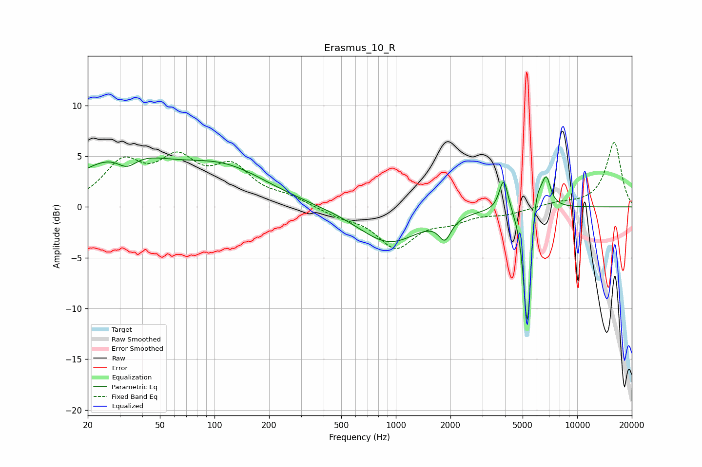

# Erasmus_10_R
See [usage instructions](https://github.com/jaakkopasanen/AutoEq#usage) for more options and info.

### Parametric EQs
Apply preamp of -4.9 dB when using parametric equalizer.

|   # | Type    |   Fc (Hz) |    Q |   Gain (dB) |
|-----|---------|-----------|------|-------------|
|   1 | Peaking |        31 | 0.59 |         4.7 |
|   2 | Peaking |        33 | 2.44 |        -1.5 |
|   3 | Peaking |       114 | 0.58 |         3.4 |
|   4 | Peaking |       915 | 0.84 |        -3.5 |
|   5 | Peaking |      1865 | 4.24 |        -2   |
|   6 | Peaking |      3933 | 5.79 |         3.3 |
|   7 | Peaking |      5316 | 6    |       -11.5 |
|   8 | Peaking |      5344 | 6    |        -3   |
|   9 | Peaking |      5838 | 3.62 |         4.8 |
|  10 | Peaking |      6767 | 5.91 |         2.5 |

### Fixed Band EQs
When using fixed band (also called graphic) equalizer, apply preamp of **-6.4 dB** (if available) and set gains manually with these parameters.

|   # | Type    |   Fc (Hz) |    Q |   Gain (dB) |
|-----|---------|-----------|------|-------------|
|   1 | Peaking |        31 | 1.41 |         4   |
|   2 | Peaking |        62 | 1.41 |         4   |
|   3 | Peaking |       125 | 1.41 |         3.5 |
|   4 | Peaking |       250 | 1.41 |         0.8 |
|   5 | Peaking |       500 | 1.41 |        -0.8 |
|   6 | Peaking |      1000 | 1.41 |        -3.8 |
|   7 | Peaking |      2000 | 1.41 |        -1.1 |
|   8 | Peaking |      4000 | 1.41 |        -0.6 |
|   9 | Peaking |      8000 | 1.41 |         0.4 |
|  10 | Peaking |     16000 | 1.41 |         6.4 |

### Graphs

