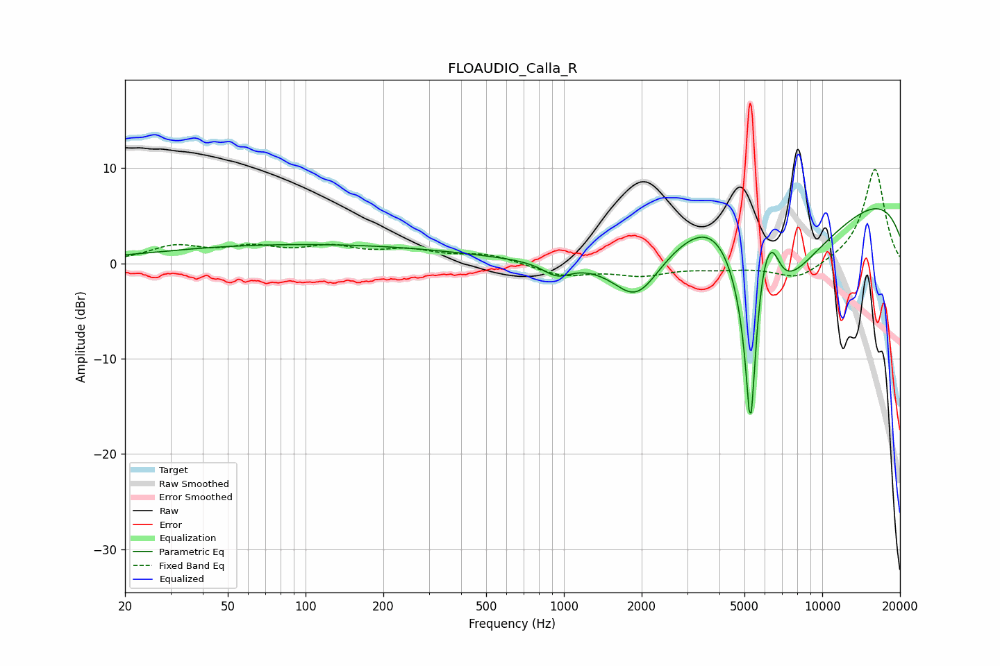

# FLOAUDIO_Calla_R
See [usage instructions](https://github.com/jaakkopasanen/AutoEq#usage) for more options and info.

### Parametric EQs
Apply preamp of -5.8 dB when using parametric equalizer.

|   # | Type    |   Fc (Hz) |    Q |   Gain (dB) |
|-----|---------|-----------|------|-------------|
|   1 | Peaking |        95 | 0.24 |         1.9 |
|   2 | Peaking |       383 | 0.57 |         0.1 |
|   3 | Peaking |       940 | 2.56 |        -1.4 |
|   4 | Peaking |      1913 | 1.54 |        -5   |
|   5 | Peaking |      3993 | 0.81 |         8.9 |
|   6 | Peaking |      5277 | 6    |       -18.7 |
|   7 | Peaking |      5857 | 4.04 |         4.8 |
|   8 | Peaking |      5967 | 0.59 |       -18.7 |
|   9 | Peaking |      6377 | 3.71 |         5.2 |
|  10 | Peaking |      9837 | 0.21 |        10.8 |

### Fixed Band EQs
When using fixed band (also called graphic) equalizer, apply preamp of **-9.9 dB** (if available) and set gains manually with these parameters.

|   # | Type    |   Fc (Hz) |    Q |   Gain (dB) |
|-----|---------|-----------|------|-------------|
|   1 | Peaking |        31 | 1.41 |         1.6 |
|   2 | Peaking |        62 | 1.41 |         1.4 |
|   3 | Peaking |       125 | 1.41 |         1.4 |
|   4 | Peaking |       250 | 1.41 |         1.2 |
|   5 | Peaking |       500 | 1.41 |         0.9 |
|   6 | Peaking |      1000 | 1.41 |        -1.3 |
|   7 | Peaking |      2000 | 1.41 |        -1.1 |
|   8 | Peaking |      4000 | 1.41 |        -0.4 |
|   9 | Peaking |      8000 | 1.41 |        -1.8 |
|  10 | Peaking |     16000 | 1.41 |        10   |

### Graphs

