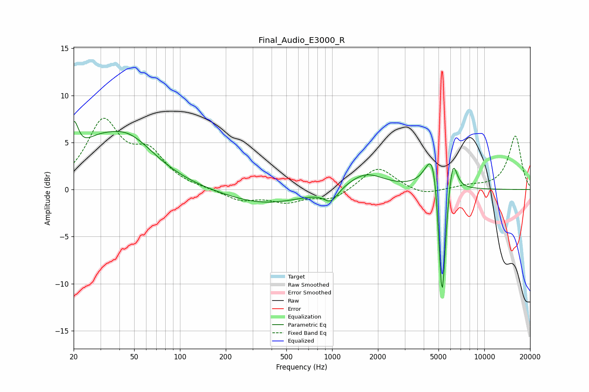

# Final_Audio_E3000_R
See [usage instructions](https://github.com/jaakkopasanen/AutoEq#usage) for more options and info.

### Parametric EQs
Apply preamp of -7.3 dB when using parametric equalizer.

|   # | Type    |   Fc (Hz) |    Q |   Gain (dB) |
|-----|---------|-----------|------|-------------|
|   1 | Peaking |        20 | 4.58 |         4.1 |
|   2 | Peaking |        27 | 1.3  |         1.9 |
|   3 | Peaking |        44 | 0.73 |         5.3 |
|   4 | Peaking |       358 | 0.55 |        -1.5 |
|   5 | Peaking |       982 | 3.14 |        -1.3 |
|   6 | Peaking |      1658 | 1.18 |         1.8 |
|   7 | Peaking |      4630 | 2.91 |         5.3 |
|   8 | Peaking |      5275 | 6    |       -11   |
|   9 | Peaking |      5278 | 6    |        -3.7 |
|  10 | Peaking |      6196 | 4.94 |         3.7 |

### Fixed Band EQs
When using fixed band (also called graphic) equalizer, apply preamp of **-7.7 dB** (if available) and set gains manually with these parameters.

|   # | Type    |   Fc (Hz) |    Q |   Gain (dB) |
|-----|---------|-----------|------|-------------|
|   1 | Peaking |        31 | 1.41 |         6.9 |
|   2 | Peaking |        62 | 1.41 |         3.4 |
|   3 | Peaking |       125 | 1.41 |         0   |
|   4 | Peaking |       250 | 1.41 |        -1.1 |
|   5 | Peaking |       500 | 1.41 |        -1.2 |
|   6 | Peaking |      1000 | 1.41 |        -1.1 |
|   7 | Peaking |      2000 | 1.41 |         2.5 |
|   8 | Peaking |      4000 | 1.41 |        -0.7 |
|   9 | Peaking |      8000 | 1.41 |         0.3 |
|  10 | Peaking |     16000 | 1.41 |         5.7 |

### Graphs

