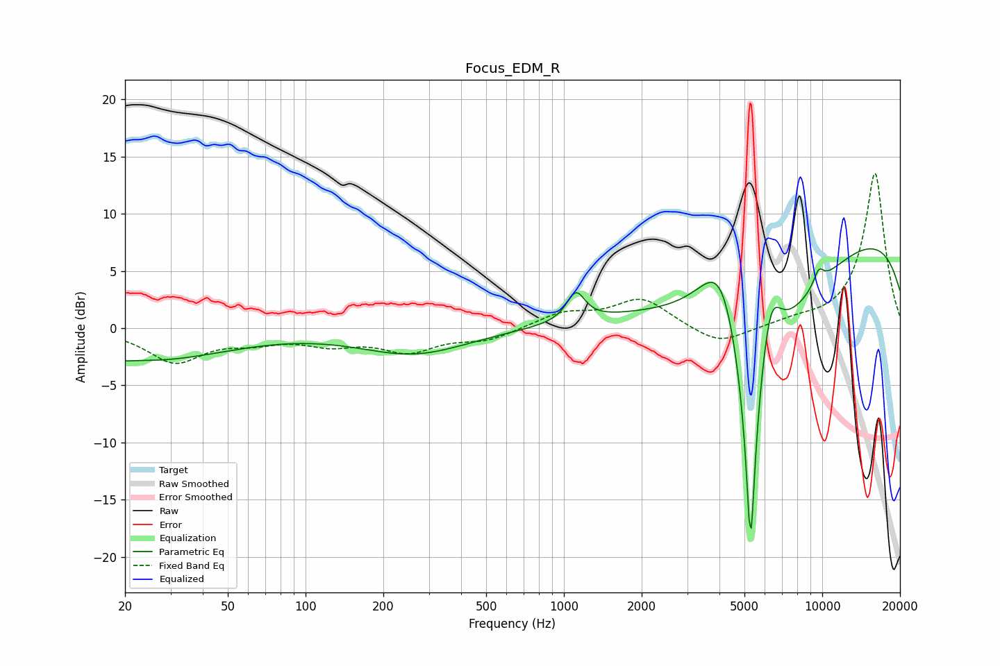

# Focus_EDM_R
See [usage instructions](https://github.com/jaakkopasanen/AutoEq#usage) for more options and info.

### Parametric EQs
Apply preamp of -7.0 dB when using parametric equalizer.

|   # | Type    |   Fc (Hz) |    Q |   Gain (dB) |
|-----|---------|-----------|------|-------------|
|   1 | Peaking |        20 | 5.05 |        -0.2 |
|   2 | Peaking |        24 | 0.45 |        -2.7 |
|   3 | Peaking |       263 | 0.67 |        -2.2 |
|   4 | Peaking |      1113 | 4.03 |         2.5 |
|   5 | Peaking |      4096 | 1.45 |         9.6 |
|   6 | Peaking |      5281 | 6    |       -20   |
|   7 | Peaking |      5307 | 0.7  |       -14.9 |
|   8 | Peaking |      6295 | 3.1  |         6.3 |
|   9 | Peaking |      9691 | 6    |         1.4 |
|  10 | Peaking |     10000 | 0.18 |         9.6 |

### Fixed Band EQs
When using fixed band (also called graphic) equalizer, apply preamp of **-13.6 dB** (if available) and set gains manually with these parameters.

|   # | Type    |   Fc (Hz) |    Q |   Gain (dB) |
|-----|---------|-----------|------|-------------|
|   1 | Peaking |        31 | 1.41 |        -2.9 |
|   2 | Peaking |        62 | 1.41 |        -0.9 |
|   3 | Peaking |       125 | 1.41 |        -1.2 |
|   4 | Peaking |       250 | 1.41 |        -1.9 |
|   5 | Peaking |       500 | 1.41 |        -1   |
|   6 | Peaking |      1000 | 1.41 |         1.3 |
|   7 | Peaking |      2000 | 1.41 |         2.6 |
|   8 | Peaking |      4000 | 1.41 |        -1.6 |
|   9 | Peaking |      8000 | 1.41 |         0.5 |
|  10 | Peaking |     16000 | 1.41 |        13.6 |

### Graphs

