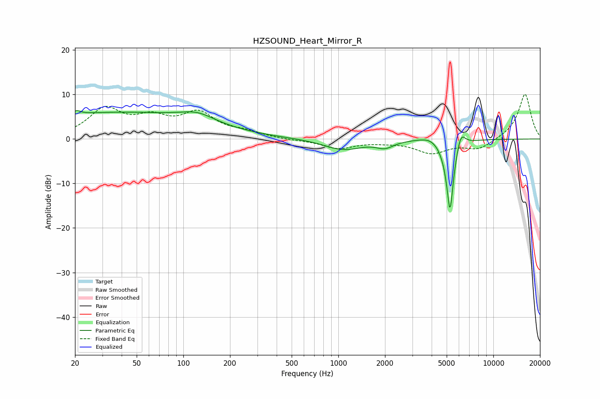

# HZSOUND_Heart_Mirror_R
See [usage instructions](https://github.com/jaakkopasanen/AutoEq#usage) for more options and info.

### Parametric EQs
Apply preamp of -6.5 dB when using parametric equalizer.

|   # | Type    |   Fc (Hz) |    Q |   Gain (dB) |
|-----|---------|-----------|------|-------------|
|   1 | Peaking |        21 | 5.86 |         3.2 |
|   2 | Peaking |        21 | 5.98 |        -2.3 |
|   3 | Peaking |        36 | 0.23 |         5.9 |
|   4 | Peaking |       123 | 1.27 |         2   |
|   5 | Peaking |      1073 | 1.15 |        -2.4 |
|   6 | Peaking |      2000 | 2.59 |        -1.5 |
|   7 | Peaking |      3967 | 1.98 |         1.2 |
|   8 | Peaking |      5133 | 3.06 |        -1.2 |
|   9 | Peaking |      5255 | 6    |       -15.9 |
|  10 | Peaking |      6164 | 4.83 |         3.8 |

### Fixed Band EQs
When using fixed band (also called graphic) equalizer, apply preamp of **-10.1 dB** (if available) and set gains manually with these parameters.

|   # | Type    |   Fc (Hz) |    Q |   Gain (dB) |
|-----|---------|-----------|------|-------------|
|   1 | Peaking |        31 | 1.41 |         6.4 |
|   2 | Peaking |        62 | 1.41 |         3.8 |
|   3 | Peaking |       125 | 1.41 |         5.3 |
|   4 | Peaking |       250 | 1.41 |         1.2 |
|   5 | Peaking |       500 | 1.41 |        -0.2 |
|   6 | Peaking |      1000 | 1.41 |        -2   |
|   7 | Peaking |      2000 | 1.41 |        -0.4 |
|   8 | Peaking |      4000 | 1.41 |        -3   |
|   9 | Peaking |      8000 | 1.41 |        -2.3 |
|  10 | Peaking |     16000 | 1.41 |        10.2 |

### Graphs

