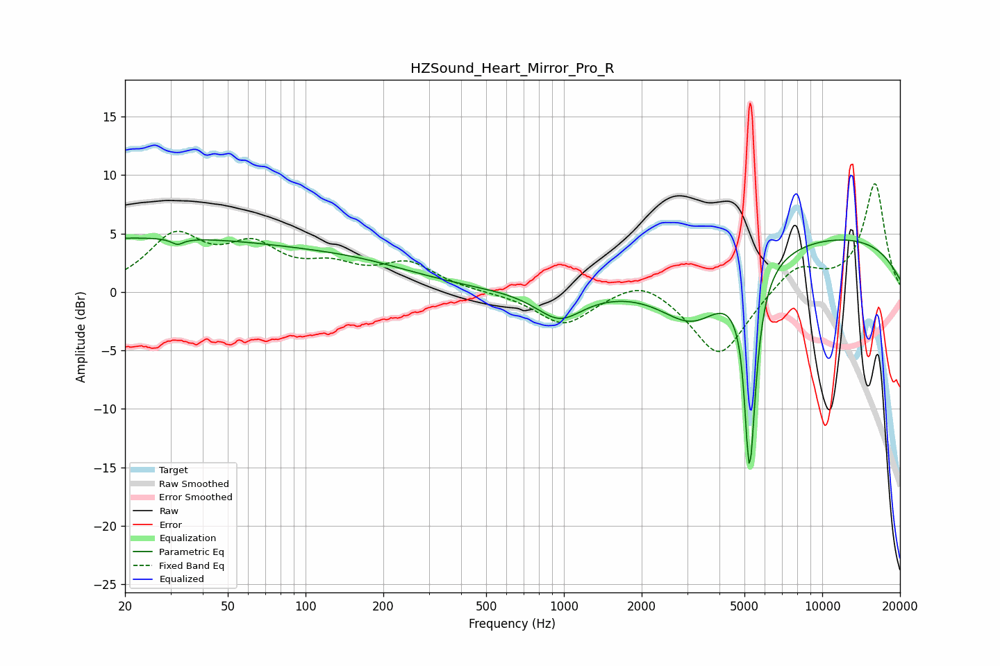

# HZSound_Heart_Mirror_Pro_R
See [usage instructions](https://github.com/jaakkopasanen/AutoEq#usage) for more options and info.

### Parametric EQs
Apply preamp of -4.7 dB when using parametric equalizer.

|   # | Type    |   Fc (Hz) |    Q |   Gain (dB) |
|-----|---------|-----------|------|-------------|
|   1 | Peaking |        22 | 0.18 |         4.6 |
|   2 | Peaking |        32 | 5.92 |        -3.3 |
|   3 | Peaking |        33 | 6    |         2.7 |
|   4 | Peaking |       169 | 0.6  |         1.2 |
|   5 | Peaking |       962 | 1.57 |        -2.5 |
|   6 | Peaking |      3173 | 1.08 |        -4.7 |
|   7 | Peaking |      5009 | 5.89 |         2.5 |
|   8 | Peaking |      5222 | 6    |        -4.9 |
|   9 | Peaking |      5224 | 6    |       -14   |
|  10 | Peaking |     10000 | 0.24 |         4.8 |

### Fixed Band EQs
When using fixed band (also called graphic) equalizer, apply preamp of **-9.3 dB** (if available) and set gains manually with these parameters.

|   # | Type    |   Fc (Hz) |    Q |   Gain (dB) |
|-----|---------|-----------|------|-------------|
|   1 | Peaking |        31 | 1.41 |         4.5 |
|   2 | Peaking |        62 | 1.41 |         3.3 |
|   3 | Peaking |       125 | 1.41 |         1.7 |
|   4 | Peaking |       250 | 1.41 |         2.3 |
|   5 | Peaking |       500 | 1.41 |        -0   |
|   6 | Peaking |      1000 | 1.41 |        -2.8 |
|   7 | Peaking |      2000 | 1.41 |         1.5 |
|   8 | Peaking |      4000 | 1.41 |        -5.7 |
|   9 | Peaking |      8000 | 1.41 |         2.3 |
|  10 | Peaking |     16000 | 1.41 |         9.2 |

### Graphs

