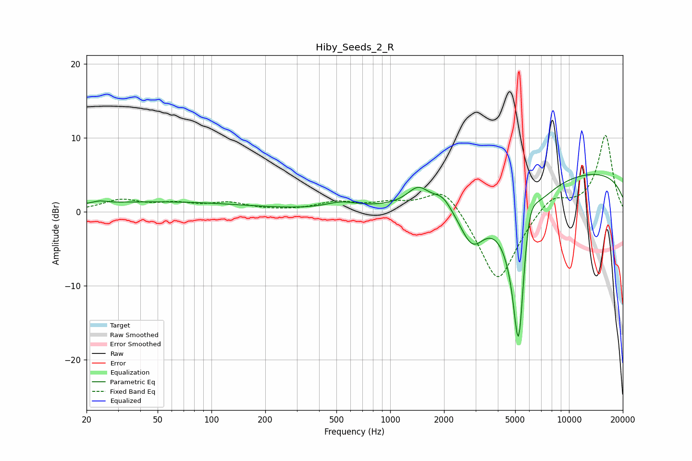

# Hiby_Seeds_2_R
See [usage instructions](https://github.com/jaakkopasanen/AutoEq#usage) for more options and info.

### Parametric EQs
Apply preamp of -5.1 dB when using parametric equalizer.

|   # | Type    |   Fc (Hz) |    Q |   Gain (dB) |
|-----|---------|-----------|------|-------------|
|   1 | Peaking |        24 | 4    |         0.3 |
|   2 | Peaking |        48 | 0.27 |         1.3 |
|   3 | Peaking |       534 | 1.61 |         0.9 |
|   4 | Peaking |      1433 | 2.4  |         2.3 |
|   5 | Peaking |      1965 | 2.97 |         1.4 |
|   6 | Peaking |      2873 | 1.86 |        -6   |
|   7 | Peaking |      5213 | 2.48 |       -19.7 |
|   8 | Peaking |      5249 | 6    |        -5.5 |
|   9 | Peaking |      5945 | 2.93 |         6.7 |
|  10 | Peaking |      9963 | 0.18 |         5.7 |

### Fixed Band EQs
When using fixed band (also called graphic) equalizer, apply preamp of **-10.4 dB** (if available) and set gains manually with these parameters.

|   # | Type    |   Fc (Hz) |    Q |   Gain (dB) |
|-----|---------|-----------|------|-------------|
|   1 | Peaking |        31 | 1.41 |         1.5 |
|   2 | Peaking |        62 | 1.41 |         0.9 |
|   3 | Peaking |       125 | 1.41 |         1.1 |
|   4 | Peaking |       250 | 1.41 |         0   |
|   5 | Peaking |       500 | 1.41 |         1.2 |
|   6 | Peaking |      1000 | 1.41 |         1   |
|   7 | Peaking |      2000 | 1.41 |         3.8 |
|   8 | Peaking |      4000 | 1.41 |        -9.9 |
|   9 | Peaking |      8000 | 1.41 |         2.5 |
|  10 | Peaking |     16000 | 1.41 |        10.4 |

### Graphs

