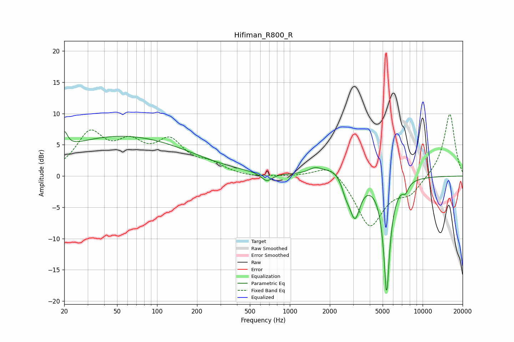

# Hifiman_R800_R
See [usage instructions](https://github.com/jaakkopasanen/AutoEq#usage) for more options and info.

### Parametric EQs
Apply preamp of -7.2 dB when using parametric equalizer.

|   # | Type    |   Fc (Hz) |    Q |   Gain (dB) |
|-----|---------|-----------|------|-------------|
|   1 | Peaking |        20 | 5.89 |         2.6 |
|   2 | Peaking |        54 | 0.27 |         6.3 |
|   3 | Peaking |       671 | 3.53 |        -1.4 |
|   4 | Peaking |      1549 | 3.01 |         0.8 |
|   5 | Peaking |      2290 | 1.3  |         1.9 |
|   6 | Peaking |      2632 | 4.88 |        -1.4 |
|   7 | Peaking |      2750 | 2.69 |        -1.1 |
|   8 | Peaking |      3098 | 3.54 |        -6.2 |
|   9 | Peaking |      5360 | 5.8  |       -18.5 |
|  10 | Peaking |      7431 | 5.94 |        -1.3 |

### Fixed Band EQs
When using fixed band (also called graphic) equalizer, apply preamp of **-10.0 dB** (if available) and set gains manually with these parameters.

|   # | Type    |   Fc (Hz) |    Q |   Gain (dB) |
|-----|---------|-----------|------|-------------|
|   1 | Peaking |        31 | 1.41 |         6.4 |
|   2 | Peaking |        62 | 1.41 |         4.2 |
|   3 | Peaking |       125 | 1.41 |         4.9 |
|   4 | Peaking |       250 | 1.41 |         1.5 |
|   5 | Peaking |       500 | 1.41 |        -0.3 |
|   6 | Peaking |      1000 | 1.41 |        -0   |
|   7 | Peaking |      2000 | 1.41 |         2.3 |
|   8 | Peaking |      4000 | 1.41 |        -8.1 |
|   9 | Peaking |      8000 | 1.41 |        -2.5 |
|  10 | Peaking |     16000 | 1.41 |        10.1 |

### Graphs

