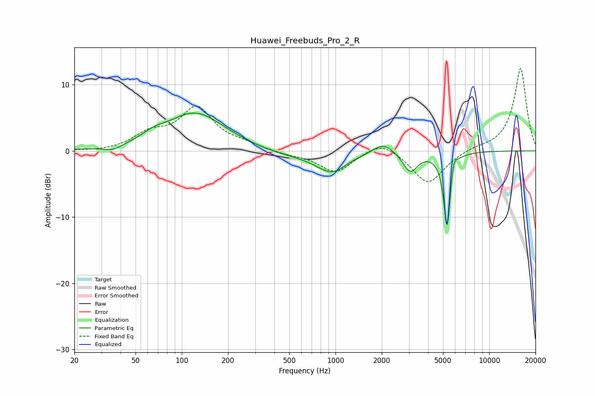

# Huawei_Freebuds_Pro_2_R
See [usage instructions](https://github.com/jaakkopasanen/AutoEq#usage) for more options and info.

### Parametric EQs
Apply preamp of -5.8 dB when using parametric equalizer.

|   # | Type    |   Fc (Hz) |    Q |   Gain (dB) |
|-----|---------|-----------|------|-------------|
|   1 | Peaking |        36 | 2.37 |        -0.8 |
|   2 | Peaking |        65 | 2.04 |         0.8 |
|   3 | Peaking |       122 | 0.74 |         5.7 |
|   4 | Peaking |       459 | 0.73 |        -0.7 |
|   5 | Peaking |       973 | 1.28 |        -3.5 |
|   6 | Peaking |      1171 | 1.7  |         0.6 |
|   7 | Peaking |      2042 | 2.03 |         1.7 |
|   8 | Peaking |      3062 | 2.99 |        -3   |
|   9 | Peaking |      5332 | 6    |       -12.2 |
|  10 | Peaking |      5820 | 6    |         2.7 |

### Fixed Band EQs
When using fixed band (also called graphic) equalizer, apply preamp of **-12.5 dB** (if available) and set gains manually with these parameters.

|   # | Type    |   Fc (Hz) |    Q |   Gain (dB) |
|-----|---------|-----------|------|-------------|
|   1 | Peaking |        31 | 1.41 |        -0.2 |
|   2 | Peaking |        62 | 1.41 |         2.3 |
|   3 | Peaking |       125 | 1.41 |         6.2 |
|   4 | Peaking |       250 | 1.41 |         0.8 |
|   5 | Peaking |       500 | 1.41 |        -0.5 |
|   6 | Peaking |      1000 | 1.41 |        -3.2 |
|   7 | Peaking |      2000 | 1.41 |         1.8 |
|   8 | Peaking |      4000 | 1.41 |        -5.1 |
|   9 | Peaking |      8000 | 1.41 |         0.4 |
|  10 | Peaking |     16000 | 1.41 |        12.5 |

### Graphs

