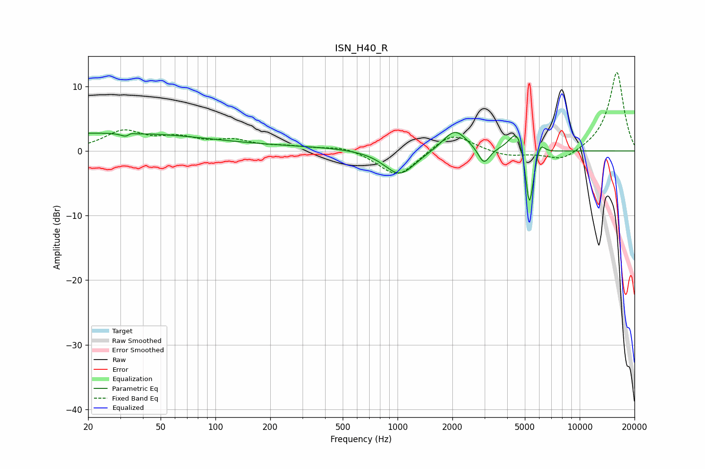

# ISN_H40_R
See [usage instructions](https://github.com/jaakkopasanen/AutoEq#usage) for more options and info.

### Parametric EQs
Apply preamp of -3.0 dB when using parametric equalizer.

|   # | Type    |   Fc (Hz) |    Q |   Gain (dB) |
|-----|---------|-----------|------|-------------|
|   1 | Peaking |        20 | 0.23 |         2.6 |
|   2 | Peaking |        33 | 5.4  |        -2.6 |
|   3 | Peaking |        34 | 6    |         2.4 |
|   4 | Peaking |       163 | 0.22 |         0.7 |
|   5 | Peaking |      1028 | 1.67 |        -4   |
|   6 | Peaking |      2066 | 2.12 |         3.5 |
|   7 | Peaking |      2980 | 4.5  |        -2.6 |
|   8 | Peaking |      4563 | 3.36 |         4.2 |
|   9 | Peaking |      5296 | 6    |       -10.1 |
|  10 | Peaking |      6072 | 6    |         2.1 |

### Fixed Band EQs
When using fixed band (also called graphic) equalizer, apply preamp of **-12.2 dB** (if available) and set gains manually with these parameters.

|   # | Type    |   Fc (Hz) |    Q |   Gain (dB) |
|-----|---------|-----------|------|-------------|
|   1 | Peaking |        31 | 1.41 |         2.9 |
|   2 | Peaking |        62 | 1.41 |         1.7 |
|   3 | Peaking |       125 | 1.41 |         1.4 |
|   4 | Peaking |       250 | 1.41 |         0.6 |
|   5 | Peaking |       500 | 1.41 |         0.8 |
|   6 | Peaking |      1000 | 1.41 |        -4.2 |
|   7 | Peaking |      2000 | 1.41 |         3   |
|   8 | Peaking |      4000 | 1.41 |        -0.9 |
|   9 | Peaking |      8000 | 1.41 |        -1.7 |
|  10 | Peaking |     16000 | 1.41 |        12.3 |

### Graphs

