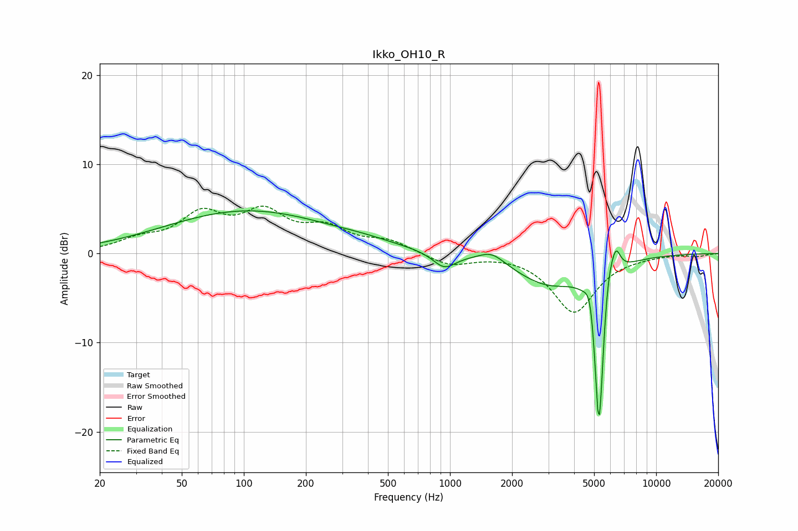

# Ikko_OH10_R
See [usage instructions](https://github.com/jaakkopasanen/AutoEq#usage) for more options and info.

### Parametric EQs
Apply preamp of -4.9 dB when using parametric equalizer.

|   # | Type    |   Fc (Hz) |    Q |   Gain (dB) |
|-----|---------|-----------|------|-------------|
|   1 | Peaking |       104 | 0.35 |         4.7 |
|   2 | Peaking |       387 | 0.96 |         0.4 |
|   3 | Peaking |       938 | 2.58 |        -1.7 |
|   4 | Peaking |      1594 | 2.25 |         1.3 |
|   5 | Peaking |      2994 | 0.86 |        -3.3 |
|   6 | Peaking |      4808 | 5.68 |         3.3 |
|   7 | Peaking |      5275 | 5.82 |       -17.2 |
|   8 | Peaking |      5334 | 6    |        -3.7 |
|   9 | Peaking |      5822 | 4.72 |         4.1 |
|  10 | Peaking |      6377 | 5.96 |         2.7 |

### Fixed Band EQs
When using fixed band (also called graphic) equalizer, apply preamp of **-5.4 dB** (if available) and set gains manually with these parameters.

|   # | Type    |   Fc (Hz) |    Q |   Gain (dB) |
|-----|---------|-----------|------|-------------|
|   1 | Peaking |        31 | 1.41 |         1.3 |
|   2 | Peaking |        62 | 1.41 |         4   |
|   3 | Peaking |       125 | 1.41 |         4.1 |
|   4 | Peaking |       250 | 1.41 |         2.4 |
|   5 | Peaking |       500 | 1.41 |         1.3 |
|   6 | Peaking |      1000 | 1.41 |        -1.3 |
|   7 | Peaking |      2000 | 1.41 |         0.1 |
|   8 | Peaking |      4000 | 1.41 |        -6.5 |
|   9 | Peaking |      8000 | 1.41 |        -0.2 |
|  10 | Peaking |     16000 | 1.41 |        -0.3 |

### Graphs

