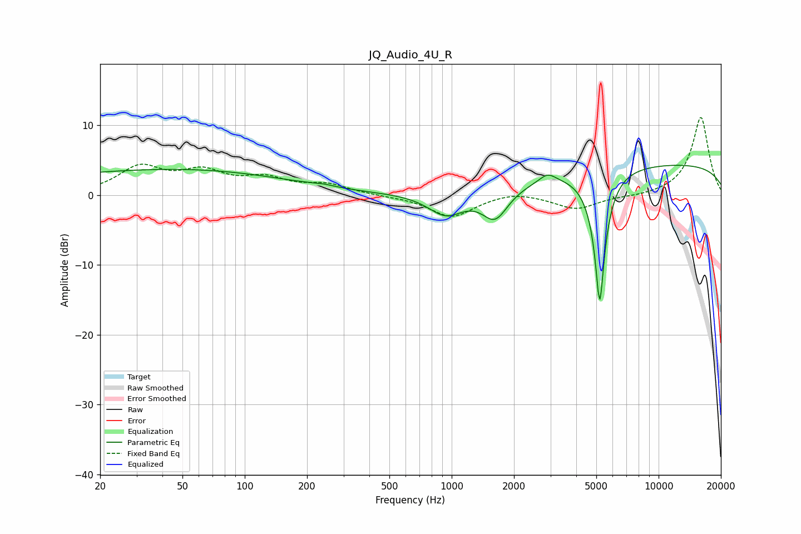

# JQ_Audio_4U_R
See [usage instructions](https://github.com/jaakkopasanen/AutoEq#usage) for more options and info.

### Parametric EQs
Apply preamp of -4.4 dB when using parametric equalizer.

|   # | Type    |   Fc (Hz) |    Q |   Gain (dB) |
|-----|---------|-----------|------|-------------|
|   1 | Peaking |        29 | 0.18 |         2.8 |
|   2 | Peaking |        72 | 0.31 |         1   |
|   3 | Peaking |       226 | 3.2  |        -3.1 |
|   4 | Peaking |       227 | 3.11 |         3.4 |
|   5 | Peaking |       938 | 1.65 |        -3.2 |
|   6 | Peaking |      1622 | 2.25 |        -4.3 |
|   7 | Peaking |      2906 | 3.57 |         1.3 |
|   8 | Peaking |      5194 | 4.98 |       -19.9 |
|   9 | Peaking |      5624 | 1.57 |         0.8 |
|  10 | Peaking |     10000 | 0.18 |         4.5 |

### Fixed Band EQs
When using fixed band (also called graphic) equalizer, apply preamp of **-11.2 dB** (if available) and set gains manually with these parameters.

|   # | Type    |   Fc (Hz) |    Q |   Gain (dB) |
|-----|---------|-----------|------|-------------|
|   1 | Peaking |        31 | 1.41 |         3.8 |
|   2 | Peaking |        62 | 1.41 |         2.9 |
|   3 | Peaking |       125 | 1.41 |         2   |
|   4 | Peaking |       250 | 1.41 |         1.4 |
|   5 | Peaking |       500 | 1.41 |        -0.1 |
|   6 | Peaking |      1000 | 1.41 |        -3.1 |
|   7 | Peaking |      2000 | 1.41 |         0.7 |
|   8 | Peaking |      4000 | 1.41 |        -2   |
|   9 | Peaking |      8000 | 1.41 |        -0.2 |
|  10 | Peaking |     16000 | 1.41 |        11.2 |

### Graphs

