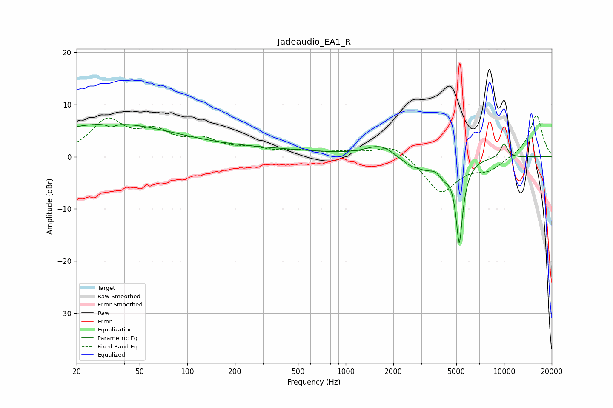

# Jadeaudio_EA1_R
See [usage instructions](https://github.com/jaakkopasanen/AutoEq#usage) for more options and info.

### Parametric EQs
Apply preamp of -6.3 dB when using parametric equalizer.

|   # | Type    |   Fc (Hz) |    Q |   Gain (dB) |
|-----|---------|-----------|------|-------------|
|   1 | Peaking |        28 | 0.34 |         5.5 |
|   2 | Peaking |        33 | 5.9  |         3.3 |
|   3 | Peaking |        33 | 5.97 |        -4   |
|   4 | Peaking |       146 | 0.2  |         1.6 |
|   5 | Peaking |      1659 | 1.6  |         2.2 |
|   6 | Peaking |      2610 | 1.96 |        -1.9 |
|   7 | Peaking |      3256 | 2.97 |        -1.1 |
|   8 | Peaking |      4168 | 4.38 |        -1.9 |
|   9 | Peaking |      5217 | 6    |       -16.2 |
|  10 | Peaking |     10000 | 5.54 |         2.7 |

### Fixed Band EQs
When using fixed band (also called graphic) equalizer, apply preamp of **-7.9 dB** (if available) and set gains manually with these parameters.

|   # | Type    |   Fc (Hz) |    Q |   Gain (dB) |
|-----|---------|-----------|------|-------------|
|   1 | Peaking |        31 | 1.41 |         6.5 |
|   2 | Peaking |        62 | 1.41 |         3.9 |
|   3 | Peaking |       125 | 1.41 |         2.7 |
|   4 | Peaking |       250 | 1.41 |         1.2 |
|   5 | Peaking |       500 | 1.41 |         0.9 |
|   6 | Peaking |      1000 | 1.41 |         0.7 |
|   7 | Peaking |      2000 | 1.41 |         2.5 |
|   8 | Peaking |      4000 | 1.41 |        -6.9 |
|   9 | Peaking |      8000 | 1.41 |        -2.3 |
|  10 | Peaking |     16000 | 1.41 |         8.1 |

### Graphs

