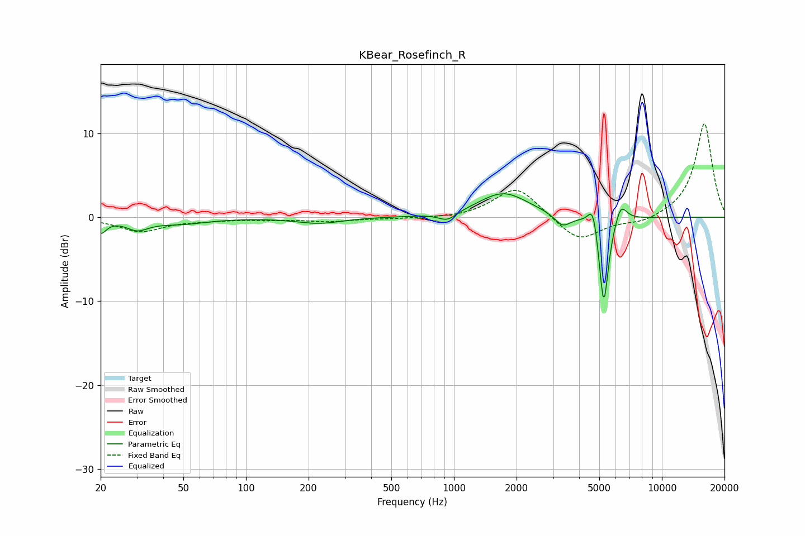

# KBear_Rosefinch_R
See [usage instructions](https://github.com/jaakkopasanen/AutoEq#usage) for more options and info.

### Parametric EQs
Apply preamp of -2.9 dB when using parametric equalizer.

|   # | Type    |   Fc (Hz) |    Q |   Gain (dB) |
|-----|---------|-----------|------|-------------|
|   1 | Peaking |        20 | 5.21 |        -1.6 |
|   2 | Peaking |        30 | 2.69 |        -1.2 |
|   3 | Peaking |        48 | 1.11 |        -0.7 |
|   4 | Peaking |       225 | 1.29 |        -0.7 |
|   5 | Peaking |       931 | 3.29 |        -1   |
|   6 | Peaking |      1729 | 1.18 |         2.9 |
|   7 | Peaking |      3330 | 3.64 |        -1.5 |
|   8 | Peaking |      4668 | 6    |         3.2 |
|   9 | Peaking |      5252 | 6    |       -11.2 |
|  10 | Peaking |      6340 | 4.77 |         2.3 |

### Fixed Band EQs
When using fixed band (also called graphic) equalizer, apply preamp of **-11.3 dB** (if available) and set gains manually with these parameters.

|   # | Type    |   Fc (Hz) |    Q |   Gain (dB) |
|-----|---------|-----------|------|-------------|
|   1 | Peaking |        31 | 1.41 |        -1.7 |
|   2 | Peaking |        62 | 1.41 |        -0.3 |
|   3 | Peaking |       125 | 1.41 |        -0.2 |
|   4 | Peaking |       250 | 1.41 |        -0.5 |
|   5 | Peaking |       500 | 1.41 |        -0.1 |
|   6 | Peaking |      1000 | 1.41 |        -0.2 |
|   7 | Peaking |      2000 | 1.41 |         3.7 |
|   8 | Peaking |      4000 | 1.41 |        -3   |
|   9 | Peaking |      8000 | 1.41 |        -0.7 |
|  10 | Peaking |     16000 | 1.41 |        11.3 |

### Graphs

