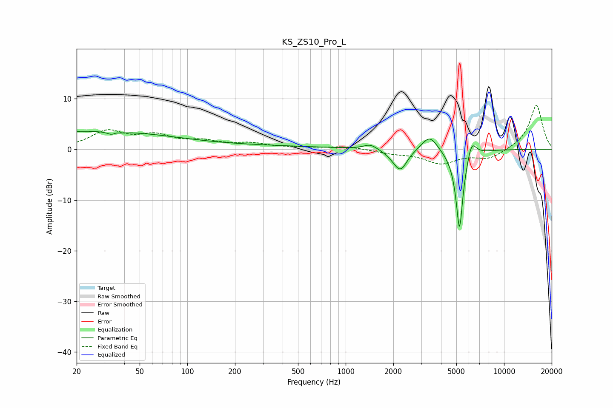

# KS_ZS10_Pro_L
See [usage instructions](https://github.com/jaakkopasanen/AutoEq#usage) for more options and info.

### Parametric EQs
Apply preamp of -3.6 dB when using parametric equalizer.

|   # | Type    |   Fc (Hz) |    Q |   Gain (dB) |
|-----|---------|-----------|------|-------------|
|   1 | Peaking |        20 | 0.24 |         3.3 |
|   2 | Peaking |        35 | 5.41 |        -3.4 |
|   3 | Peaking |        35 | 6    |         3   |
|   4 | Peaking |       140 | 0.18 |         0.7 |
|   5 | Peaking |      1432 | 3.26 |         1.1 |
|   6 | Peaking |      2031 | 2.86 |        -0.9 |
|   7 | Peaking |      2229 | 3.44 |        -3.6 |
|   8 | Peaking |      3392 | 2.85 |         3.1 |
|   9 | Peaking |      5233 | 5.89 |       -16.5 |
|  10 | Peaking |      6236 | 4.87 |         3.6 |

### Fixed Band EQs
When using fixed band (also called graphic) equalizer, apply preamp of **-8.7 dB** (if available) and set gains manually with these parameters.

|   # | Type    |   Fc (Hz) |    Q |   Gain (dB) |
|-----|---------|-----------|------|-------------|
|   1 | Peaking |        31 | 1.41 |         3.4 |
|   2 | Peaking |        62 | 1.41 |         2.4 |
|   3 | Peaking |       125 | 1.41 |         1.3 |
|   4 | Peaking |       250 | 1.41 |         1   |
|   5 | Peaking |       500 | 1.41 |         0.2 |
|   6 | Peaking |      1000 | 1.41 |         0.6 |
|   7 | Peaking |      2000 | 1.41 |        -0.7 |
|   8 | Peaking |      4000 | 1.41 |        -2.6 |
|   9 | Peaking |      8000 | 1.41 |        -1.8 |
|  10 | Peaking |     16000 | 1.41 |         8.8 |

### Graphs

