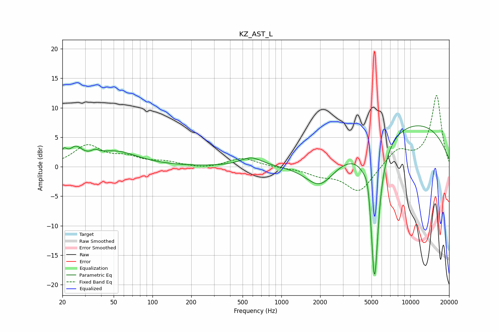

# KZ_AST_L
See [usage instructions](https://github.com/jaakkopasanen/AutoEq#usage) for more options and info.

### Parametric EQs
Apply preamp of -7.0 dB when using parametric equalizer.

|   # | Type    |   Fc (Hz) |    Q |   Gain (dB) |
|-----|---------|-----------|------|-------------|
|   1 | Peaking |        20 | 5.95 |         1.6 |
|   2 | Peaking |        25 | 2.89 |         2.3 |
|   3 | Peaking |        36 | 5.13 |         0.7 |
|   4 | Peaking |        51 | 0.83 |         2.5 |
|   5 | Peaking |       585 | 1.64 |         1.5 |
|   6 | Peaking |      1998 | 1.24 |        -4.5 |
|   7 | Peaking |      4686 | 6    |         2.5 |
|   8 | Peaking |      5243 | 4.11 |       -19.3 |
|   9 | Peaking |      5380 | 6    |        -5.9 |
|  10 | Peaking |     10000 | 0.29 |         7.5 |

### Fixed Band EQs
When using fixed band (also called graphic) equalizer, apply preamp of **-12.2 dB** (if available) and set gains manually with these parameters.

|   # | Type    |   Fc (Hz) |    Q |   Gain (dB) |
|-----|---------|-----------|------|-------------|
|   1 | Peaking |        31 | 1.41 |         3.5 |
|   2 | Peaking |        62 | 1.41 |         1.4 |
|   3 | Peaking |       125 | 1.41 |         0.7 |
|   4 | Peaking |       250 | 1.41 |        -0.4 |
|   5 | Peaking |       500 | 1.41 |         1.5 |
|   6 | Peaking |      1000 | 1.41 |        -0.1 |
|   7 | Peaking |      2000 | 1.41 |        -1.2 |
|   8 | Peaking |      4000 | 1.41 |        -4.4 |
|   9 | Peaking |      8000 | 1.41 |         2.9 |
|  10 | Peaking |     16000 | 1.41 |        12.1 |

### Graphs

