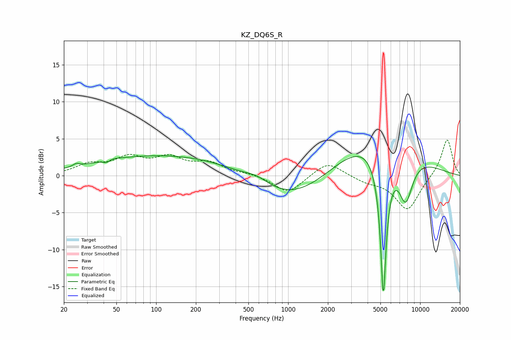

# KZ_DQ6S_R
See [usage instructions](https://github.com/jaakkopasanen/AutoEq#usage) for more options and info.

### Parametric EQs
Apply preamp of -2.8 dB when using parametric equalizer.

|   # | Type    |   Fc (Hz) |    Q |   Gain (dB) |
|-----|---------|-----------|------|-------------|
|   1 | Peaking |        25 | 5.66 |         0.4 |
|   2 | Peaking |        42 | 5.14 |        -0.5 |
|   3 | Peaking |        43 | 2.3  |        -0.3 |
|   4 | Peaking |        44 | 2.63 |         0.6 |
|   5 | Peaking |       133 | 0.22 |         2.9 |
|   6 | Peaking |       579 | 1.45 |         1   |
|   7 | Peaking |      1084 | 0.45 |        -4.3 |
|   8 | Peaking |      4410 | 0.42 |         5.9 |
|   9 | Peaking |      5260 | 5.78 |       -20   |
|  10 | Peaking |      7759 | 2.38 |        -6.3 |

### Fixed Band EQs
When using fixed band (also called graphic) equalizer, apply preamp of **-4.9 dB** (if available) and set gains manually with these parameters.

|   # | Type    |   Fc (Hz) |    Q |   Gain (dB) |
|-----|---------|-----------|------|-------------|
|   1 | Peaking |        31 | 1.41 |         1.4 |
|   2 | Peaking |        62 | 1.41 |         2.2 |
|   3 | Peaking |       125 | 1.41 |         2.1 |
|   4 | Peaking |       250 | 1.41 |         1.5 |
|   5 | Peaking |       500 | 1.41 |         0.3 |
|   6 | Peaking |      1000 | 1.41 |        -2.4 |
|   7 | Peaking |      2000 | 1.41 |         2   |
|   8 | Peaking |      4000 | 1.41 |        -0.7 |
|   9 | Peaking |      8000 | 1.41 |        -4.7 |
|  10 | Peaking |     16000 | 1.41 |         5.1 |

### Graphs

