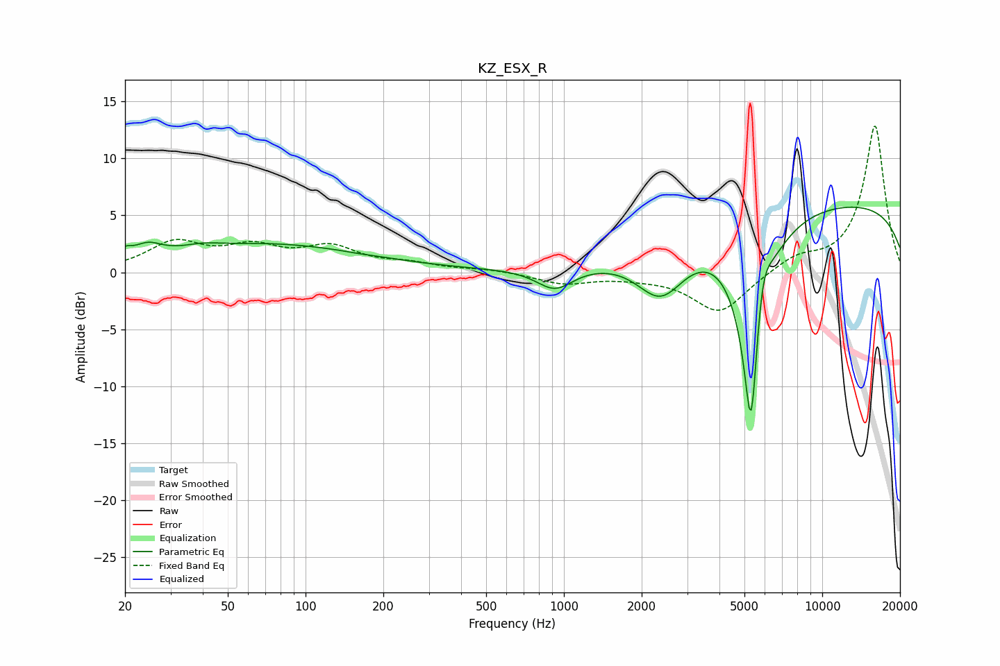

# KZ_ESX_R
See [usage instructions](https://github.com/jaakkopasanen/AutoEq#usage) for more options and info.

### Parametric EQs
Apply preamp of -5.8 dB when using parametric equalizer.

|   # | Type    |   Fc (Hz) |    Q |   Gain (dB) |
|-----|---------|-----------|------|-------------|
|   1 | Peaking |        20 | 5.87 |         0.7 |
|   2 | Peaking |        24 | 2.63 |         1.1 |
|   3 | Peaking |        40 | 2.22 |         0.4 |
|   4 | Peaking |        70 | 0.36 |         2.4 |
|   5 | Peaking |       158 | 4.44 |        -0   |
|   6 | Peaking |       923 | 1.97 |        -2   |
|   7 | Peaking |      2375 | 1.47 |        -4.6 |
|   8 | Peaking |      5306 | 3.46 |       -20   |
|   9 | Peaking |      5837 | 4.09 |         4.7 |
|  10 | Peaking |     10000 | 0.18 |         6.3 |

### Fixed Band EQs
When using fixed band (also called graphic) equalizer, apply preamp of **-12.9 dB** (if available) and set gains manually with these parameters.

|   # | Type    |   Fc (Hz) |    Q |   Gain (dB) |
|-----|---------|-----------|------|-------------|
|   1 | Peaking |        31 | 1.41 |         2.5 |
|   2 | Peaking |        62 | 1.41 |         1.9 |
|   3 | Peaking |       125 | 1.41 |         2   |
|   4 | Peaking |       250 | 1.41 |         0.6 |
|   5 | Peaking |       500 | 1.41 |         0.2 |
|   6 | Peaking |      1000 | 1.41 |        -1   |
|   7 | Peaking |      2000 | 1.41 |        -0.3 |
|   8 | Peaking |      4000 | 1.41 |        -3.6 |
|   9 | Peaking |      8000 | 1.41 |         1.2 |
|  10 | Peaking |     16000 | 1.41 |        12.9 |

### Graphs

