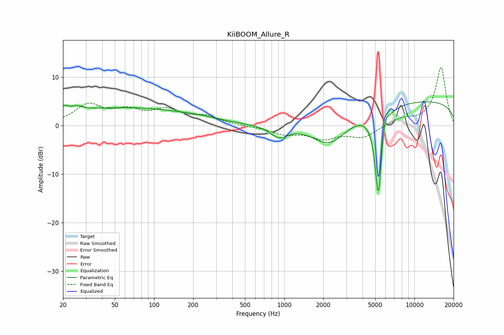

# KiiBOOM_Allure_R
See [usage instructions](https://github.com/jaakkopasanen/AutoEq#usage) for more options and info.

### Parametric EQs
Apply preamp of -5.0 dB when using parametric equalizer.

|   # | Type    |   Fc (Hz) |    Q |   Gain (dB) |
|-----|---------|-----------|------|-------------|
|   1 | Peaking |        22 | 2.51 |         3.4 |
|   2 | Peaking |        23 | 4.54 |        -1.8 |
|   3 | Peaking |        63 | 0.29 |         3.6 |
|   4 | Peaking |       220 | 0.98 |         0.4 |
|   5 | Peaking |       912 | 2.14 |        -2.4 |
|   6 | Peaking |      2248 | 1.02 |        -5.9 |
|   7 | Peaking |      5268 | 6    |        -4   |
|   8 | Peaking |      5296 | 4.89 |       -14.2 |
|   9 | Peaking |      5914 | 5.78 |         3.4 |
|  10 | Peaking |     10000 | 0.18 |         5.2 |

### Fixed Band EQs
When using fixed band (also called graphic) equalizer, apply preamp of **-12.1 dB** (if available) and set gains manually with these parameters.

|   # | Type    |   Fc (Hz) |    Q |   Gain (dB) |
|-----|---------|-----------|------|-------------|
|   1 | Peaking |        31 | 1.41 |         4.1 |
|   2 | Peaking |        62 | 1.41 |         2.6 |
|   3 | Peaking |       125 | 1.41 |         2.8 |
|   4 | Peaking |       250 | 1.41 |         1.7 |
|   5 | Peaking |       500 | 1.41 |        -0.1 |
|   6 | Peaking |      1000 | 1.41 |        -1.6 |
|   7 | Peaking |      2000 | 1.41 |        -2.4 |
|   8 | Peaking |      4000 | 1.41 |        -2.3 |
|   9 | Peaking |      8000 | 1.41 |         1.3 |
|  10 | Peaking |     16000 | 1.41 |        12.1 |

### Graphs

