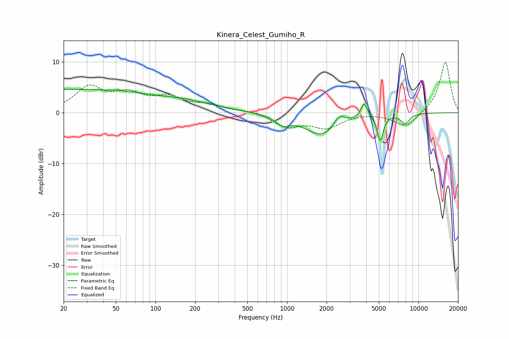

# Kinera_Celest_Gumiho_R
See [usage instructions](https://github.com/jaakkopasanen/AutoEq#usage) for more options and info.

### Parametric EQs
Apply preamp of -4.7 dB when using parametric equalizer.

|   # | Type    |   Fc (Hz) |    Q |   Gain (dB) |
|-----|---------|-----------|------|-------------|
|   1 | Peaking |        20 | 0.19 |         4.5 |
|   2 | Peaking |        58 | 4.82 |         3.6 |
|   3 | Peaking |        58 | 5.45 |        -3.4 |
|   4 | Peaking |       171 | 0.61 |         1.4 |
|   5 | Peaking |       927 | 2.61 |        -1.7 |
|   6 | Peaking |      1833 | 1.13 |        -4.4 |
|   7 | Peaking |      2494 | 3.71 |         2.1 |
|   8 | Peaking |      3869 | 6    |         2.9 |
|   9 | Peaking |      5117 | 6    |        -5.1 |
|  10 | Peaking |      7928 | 4.03 |        -1.9 |

### Fixed Band EQs
When using fixed band (also called graphic) equalizer, apply preamp of **-10.0 dB** (if available) and set gains manually with these parameters.

|   # | Type    |   Fc (Hz) |    Q |   Gain (dB) |
|-----|---------|-----------|------|-------------|
|   1 | Peaking |        31 | 1.41 |         4.8 |
|   2 | Peaking |        62 | 1.41 |         3.1 |
|   3 | Peaking |       125 | 1.41 |         2.6 |
|   4 | Peaking |       250 | 1.41 |         1.3 |
|   5 | Peaking |       500 | 1.41 |         0.4 |
|   6 | Peaking |      1000 | 1.41 |        -2.6 |
|   7 | Peaking |      2000 | 1.41 |        -2.7 |
|   8 | Peaking |      4000 | 1.41 |         0.1 |
|   9 | Peaking |      8000 | 1.41 |        -2.9 |
|  10 | Peaking |     16000 | 1.41 |        10.1 |

### Graphs

