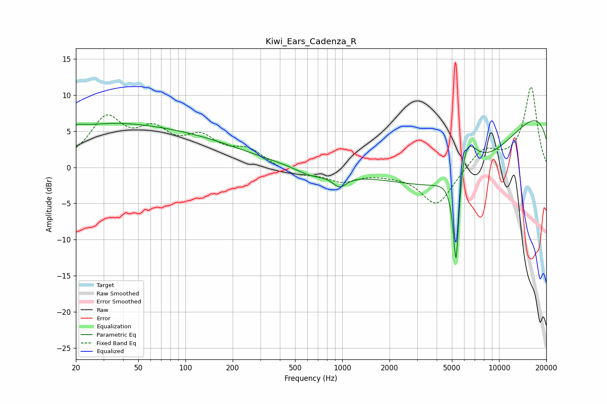

# Kiwi_Ears_Cadenza_R
See [usage instructions](https://github.com/jaakkopasanen/AutoEq#usage) for more options and info.

### Parametric EQs
Apply preamp of -6.5 dB when using parametric equalizer.

|   # | Type    |   Fc (Hz) |    Q |   Gain (dB) |
|-----|---------|-----------|------|-------------|
|   1 | Peaking |        21 | 5.59 |         3.4 |
|   2 | Peaking |        21 | 5.99 |        -2.9 |
|   3 | Peaking |        33 | 0.66 |         0.6 |
|   4 | Peaking |        41 | 0.19 |         5.5 |
|   5 | Peaking |       628 | 1.42 |        -1   |
|   6 | Peaking |       962 | 3.18 |        -1.6 |
|   7 | Peaking |      5320 | 6    |       -16.9 |
|   8 | Peaking |      5621 | 0.35 |       -15.2 |
|   9 | Peaking |      5938 | 1.78 |        10   |
|  10 | Peaking |     10000 | 0.18 |        12.6 |

### Fixed Band EQs
When using fixed band (also called graphic) equalizer, apply preamp of **-11.2 dB** (if available) and set gains manually with these parameters.

|   # | Type    |   Fc (Hz) |    Q |   Gain (dB) |
|-----|---------|-----------|------|-------------|
|   1 | Peaking |        31 | 1.41 |         6.3 |
|   2 | Peaking |        62 | 1.41 |         4.1 |
|   3 | Peaking |       125 | 1.41 |         3.5 |
|   4 | Peaking |       250 | 1.41 |         2.2 |
|   5 | Peaking |       500 | 1.41 |        -1.1 |
|   6 | Peaking |      1000 | 1.41 |        -1.8 |
|   7 | Peaking |      2000 | 1.41 |        -0.5 |
|   8 | Peaking |      4000 | 1.41 |        -5.3 |
|   9 | Peaking |      8000 | 1.41 |         2.6 |
|  10 | Peaking |     16000 | 1.41 |        11.1 |

### Graphs

