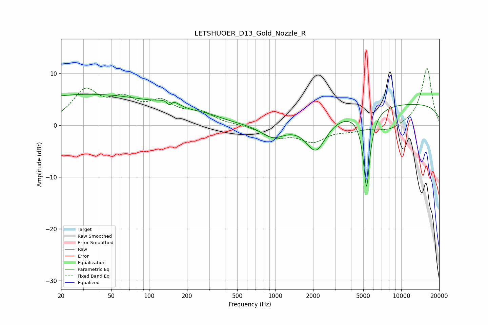

# LETSHUOER_D13_Gold_Nozzle_R
See [usage instructions](https://github.com/jaakkopasanen/AutoEq#usage) for more options and info.

### Parametric EQs
Apply preamp of -6.1 dB when using parametric equalizer.

|   # | Type    |   Fc (Hz) |    Q |   Gain (dB) |
|-----|---------|-----------|------|-------------|
|   1 | Peaking |        32 | 0.21 |         5.9 |
|   2 | Peaking |       146 | 1.82 |         1.9 |
|   3 | Peaking |       147 | 5.79 |        -3.7 |
|   4 | Peaking |       149 | 5.45 |         2.8 |
|   5 | Peaking |       156 | 1.47 |        -0.4 |
|   6 | Peaking |       283 | 1.11 |         0.9 |
|   7 | Peaking |       958 | 1.48 |        -2.6 |
|   8 | Peaking |      2107 | 1.73 |        -6.4 |
|   9 | Peaking |      5310 | 5.06 |       -15.3 |
|  10 | Peaking |     10000 | 0.18 |         4.2 |

### Fixed Band EQs
When using fixed band (also called graphic) equalizer, apply preamp of **-11.1 dB** (if available) and set gains manually with these parameters.

|   # | Type    |   Fc (Hz) |    Q |   Gain (dB) |
|-----|---------|-----------|------|-------------|
|   1 | Peaking |        31 | 1.41 |         6.2 |
|   2 | Peaking |        62 | 1.41 |         4   |
|   3 | Peaking |       125 | 1.41 |         3.8 |
|   4 | Peaking |       250 | 1.41 |         2.2 |
|   5 | Peaking |       500 | 1.41 |         0   |
|   6 | Peaking |      1000 | 1.41 |        -2.1 |
|   7 | Peaking |      2000 | 1.41 |        -2.9 |
|   8 | Peaking |      4000 | 1.41 |        -0.8 |
|   9 | Peaking |      8000 | 1.41 |        -1.2 |
|  10 | Peaking |     16000 | 1.41 |        11.1 |

### Graphs

