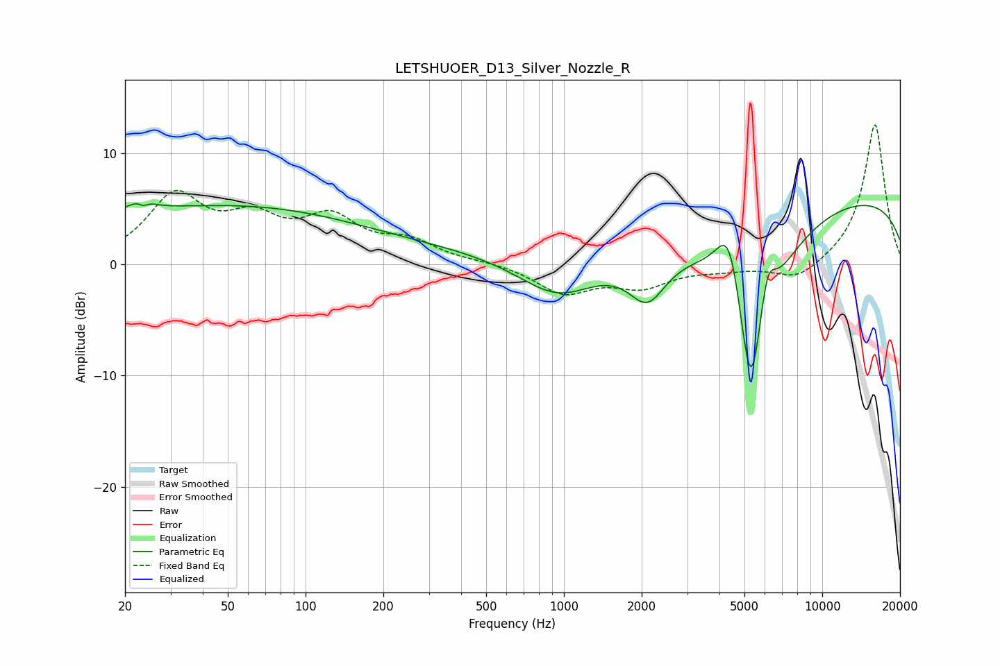

# LETSHUOER_D13_Silver_Nozzle_R
See [usage instructions](https://github.com/jaakkopasanen/AutoEq#usage) for more options and info.

### Parametric EQs
Apply preamp of -5.5 dB when using parametric equalizer.

|   # | Type    |   Fc (Hz) |    Q |   Gain (dB) |
|-----|---------|-----------|------|-------------|
|   1 | Peaking |        23 | 4.79 |         3.1 |
|   2 | Peaking |        23 | 5.82 |        -2.7 |
|   3 | Peaking |        29 | 0.18 |         4.6 |
|   4 | Peaking |       184 | 0.22 |         1.3 |
|   5 | Peaking |       950 | 0.92 |        -3.7 |
|   6 | Peaking |      2107 | 1.9  |        -4.2 |
|   7 | Peaking |      4385 | 2.53 |         7.7 |
|   8 | Peaking |      5291 | 1.82 |       -20   |
|   9 | Peaking |      6118 | 4.22 |         4.6 |
|  10 | Peaking |     10000 | 0.18 |         6.4 |

### Fixed Band EQs
When using fixed band (also called graphic) equalizer, apply preamp of **-12.6 dB** (if available) and set gains manually with these parameters.

|   # | Type    |   Fc (Hz) |    Q |   Gain (dB) |
|-----|---------|-----------|------|-------------|
|   1 | Peaking |        31 | 1.41 |         5.9 |
|   2 | Peaking |        62 | 1.41 |         3.3 |
|   3 | Peaking |       125 | 1.41 |         3.7 |
|   4 | Peaking |       250 | 1.41 |         1.8 |
|   5 | Peaking |       500 | 1.41 |         0.2 |
|   6 | Peaking |      1000 | 1.41 |        -2.5 |
|   7 | Peaking |      2000 | 1.41 |        -1.8 |
|   8 | Peaking |      4000 | 1.41 |        -0.4 |
|   9 | Peaking |      8000 | 1.41 |        -1.6 |
|  10 | Peaking |     16000 | 1.41 |        12.7 |

### Graphs

