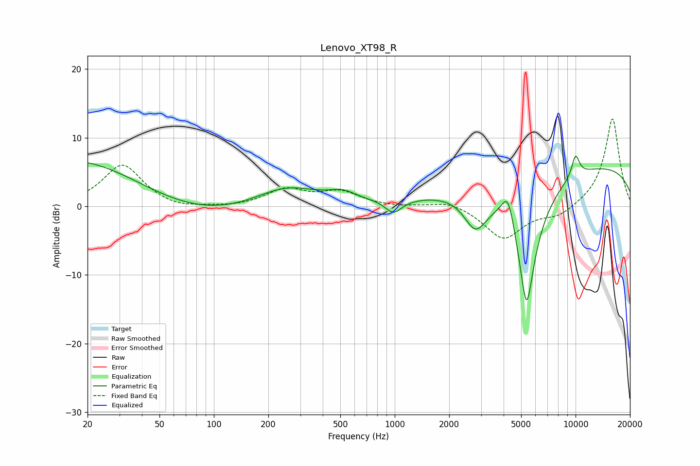

# Lenovo_XT98_R
See [usage instructions](https://github.com/jaakkopasanen/AutoEq#usage) for more options and info.

### Parametric EQs
Apply preamp of -7.4 dB when using parametric equalizer.

|   # | Type    |   Fc (Hz) |    Q |   Gain (dB) |
|-----|---------|-----------|------|-------------|
|   1 | Peaking |        21 | 0.32 |         8.6 |
|   2 | Peaking |        57 | 0.38 |        -4.3 |
|   3 | Peaking |       252 | 0.8  |         3   |
|   4 | Peaking |       516 | 1.87 |         1.3 |
|   5 | Peaking |       985 | 3.09 |        -2   |
|   6 | Peaking |      2799 | 2.18 |        -5.1 |
|   7 | Peaking |      4238 | 3.86 |         5   |
|   8 | Peaking |      5360 | 2.33 |       -20   |
|   9 | Peaking |     10000 | 5.48 |         3.2 |
|  10 | Peaking |     10000 | 0.18 |         6.3 |

### Fixed Band EQs
When using fixed band (also called graphic) equalizer, apply preamp of **-12.8 dB** (if available) and set gains manually with these parameters.

|   # | Type    |   Fc (Hz) |    Q |   Gain (dB) |
|-----|---------|-----------|------|-------------|
|   1 | Peaking |        31 | 1.41 |         6.1 |
|   2 | Peaking |        62 | 1.41 |        -0.6 |
|   3 | Peaking |       125 | 1.41 |        -0.2 |
|   4 | Peaking |       250 | 1.41 |         2.4 |
|   5 | Peaking |       500 | 1.41 |         2   |
|   6 | Peaking |      1000 | 1.41 |        -0.1 |
|   7 | Peaking |      2000 | 1.41 |         0.9 |
|   8 | Peaking |      4000 | 1.41 |        -4.8 |
|   9 | Peaking |      8000 | 1.41 |        -1.5 |
|  10 | Peaking |     16000 | 1.41 |        12.9 |

### Graphs

