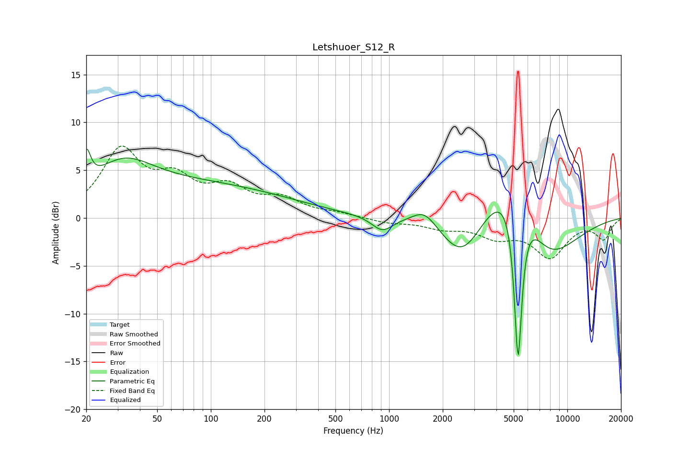

# Letshuoer_S12_R
See [usage instructions](https://github.com/jaakkopasanen/AutoEq#usage) for more options and info.

### Parametric EQs
Apply preamp of -7.3 dB when using parametric equalizer.

|   # | Type    |   Fc (Hz) |    Q |   Gain (dB) |
|-----|---------|-----------|------|-------------|
|   1 | Peaking |        20 | 5.98 |         3.4 |
|   2 | Peaking |        32 | 0.85 |         3.6 |
|   3 | Peaking |        83 | 0.27 |         3.4 |
|   4 | Peaking |       915 | 2.4  |        -1.5 |
|   5 | Peaking |      1581 | 2.07 |         1.7 |
|   6 | Peaking |      2586 | 1.14 |        -5.4 |
|   7 | Peaking |      5176 | 0.82 |        10.1 |
|   8 | Peaking |      5289 | 6    |        -2.3 |
|   9 | Peaking |      5291 | 6    |       -15.6 |
|  10 | Peaking |      7498 | 0.77 |        -7.9 |

### Fixed Band EQs
When using fixed band (also called graphic) equalizer, apply preamp of **-7.6 dB** (if available) and set gains manually with these parameters.

|   # | Type    |   Fc (Hz) |    Q |   Gain (dB) |
|-----|---------|-----------|------|-------------|
|   1 | Peaking |        31 | 1.41 |         6.8 |
|   2 | Peaking |        62 | 1.41 |         3.4 |
|   3 | Peaking |       125 | 1.41 |         2.7 |
|   4 | Peaking |       250 | 1.41 |         1.7 |
|   5 | Peaking |       500 | 1.41 |         0.4 |
|   6 | Peaking |      1000 | 1.41 |        -0.5 |
|   7 | Peaking |      2000 | 1.41 |        -0.9 |
|   8 | Peaking |      4000 | 1.41 |        -1.7 |
|   9 | Peaking |      8000 | 1.41 |        -3.9 |
|  10 | Peaking |     16000 | 1.41 |        -2.1 |

### Graphs

