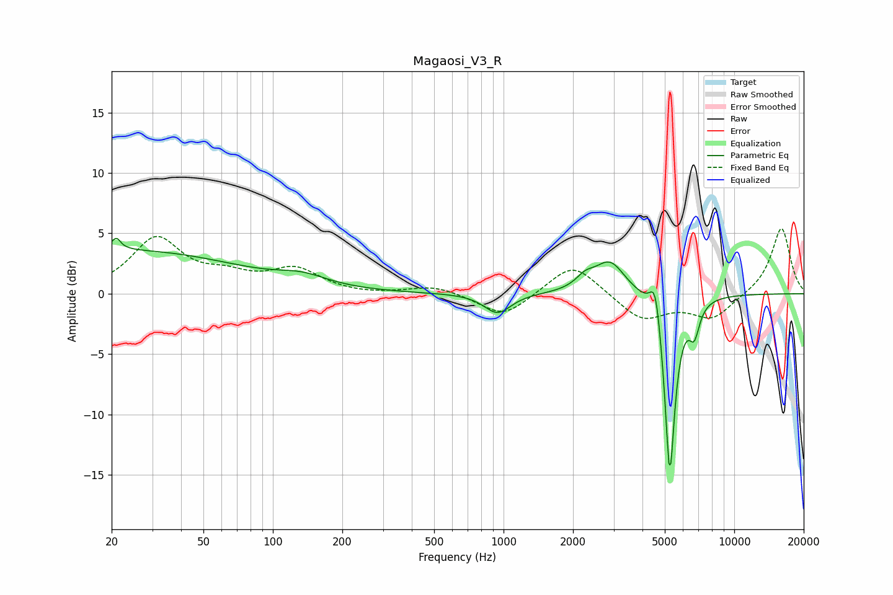

# Magaosi_V3_R
See [usage instructions](https://github.com/jaakkopasanen/AutoEq#usage) for more options and info.

### Parametric EQs
Apply preamp of -4.7 dB when using parametric equalizer.

|   # | Type    |   Fc (Hz) |    Q |   Gain (dB) |
|-----|---------|-----------|------|-------------|
|   1 | Peaking |        21 | 5.81 |         3.2 |
|   2 | Peaking |        22 | 6    |        -2.2 |
|   3 | Peaking |        24 | 0.3  |         3.5 |
|   4 | Peaking |       134 | 1.31 |         0.8 |
|   5 | Peaking |       941 | 2.45 |        -1.7 |
|   6 | Peaking |      2257 | 3.49 |         0.9 |
|   7 | Peaking |      2892 | 2.14 |         2.7 |
|   8 | Peaking |      4551 | 5.98 |         3.2 |
|   9 | Peaking |      5255 | 6    |       -15.4 |
|  10 | Peaking |      6709 | 6    |        -2.4 |

### Fixed Band EQs
When using fixed band (also called graphic) equalizer, apply preamp of **-5.5 dB** (if available) and set gains manually with these parameters.

|   # | Type    |   Fc (Hz) |    Q |   Gain (dB) |
|-----|---------|-----------|------|-------------|
|   1 | Peaking |        31 | 1.41 |         4.5 |
|   2 | Peaking |        62 | 1.41 |         1.2 |
|   3 | Peaking |       125 | 1.41 |         1.9 |
|   4 | Peaking |       250 | 1.41 |        -0.1 |
|   5 | Peaking |       500 | 1.41 |         0.7 |
|   6 | Peaking |      1000 | 1.41 |        -2   |
|   7 | Peaking |      2000 | 1.41 |         2.7 |
|   8 | Peaking |      4000 | 1.41 |        -2.2 |
|   9 | Peaking |      8000 | 1.41 |        -2   |
|  10 | Peaking |     16000 | 1.41 |         5.5 |

### Graphs

