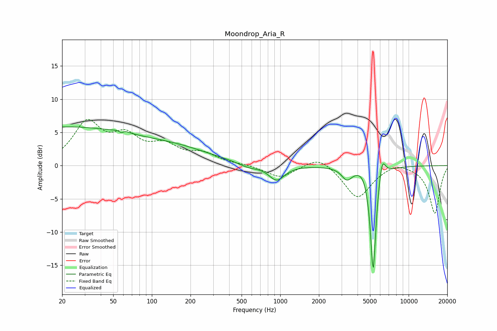

# Moondrop_Aria_R
See [usage instructions](https://github.com/jaakkopasanen/AutoEq#usage) for more options and info.

### Parametric EQs
Apply preamp of -5.9 dB when using parametric equalizer.

|   # | Type    |   Fc (Hz) |    Q |   Gain (dB) |
|-----|---------|-----------|------|-------------|
|   1 | Peaking |        20 | 0.21 |         5.7 |
|   2 | Peaking |        58 | 5.95 |        -3.6 |
|   3 | Peaking |        58 | 5.31 |         3.6 |
|   4 | Peaking |       167 | 0.51 |         1.8 |
|   5 | Peaking |       564 | 1.8  |        -0.6 |
|   6 | Peaking |       937 | 2.32 |        -2.3 |
|   7 | Peaking |      3306 | 3.46 |        -1.8 |
|   8 | Peaking |      4473 | 3.01 |         1.1 |
|   9 | Peaking |      5291 | 6    |       -16.9 |
|  10 | Peaking |      6194 | 5.15 |         3.6 |

### Fixed Band EQs
When using fixed band (also called graphic) equalizer, apply preamp of **-7.1 dB** (if available) and set gains manually with these parameters.

|   # | Type    |   Fc (Hz) |    Q |   Gain (dB) |
|-----|---------|-----------|------|-------------|
|   1 | Peaking |        31 | 1.41 |         6.1 |
|   2 | Peaking |        62 | 1.41 |         3.7 |
|   3 | Peaking |       125 | 1.41 |         2.6 |
|   4 | Peaking |       250 | 1.41 |         1.6 |
|   5 | Peaking |       500 | 1.41 |         0.1 |
|   6 | Peaking |      1000 | 1.41 |        -1.8 |
|   7 | Peaking |      2000 | 1.41 |         1.7 |
|   8 | Peaking |      4000 | 1.41 |        -4.9 |
|   9 | Peaking |      8000 | 1.41 |         0.8 |
|  10 | Peaking |     16000 | 1.41 |        -7.2 |

### Graphs

