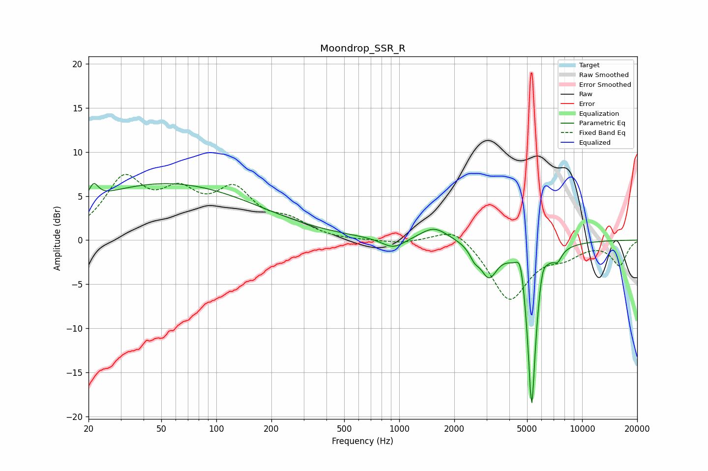

# Moondrop_SSR_R
See [usage instructions](https://github.com/jaakkopasanen/AutoEq#usage) for more options and info.

### Parametric EQs
Apply preamp of -6.5 dB when using parametric equalizer.

|   # | Type    |   Fc (Hz) |    Q |   Gain (dB) |
|-----|---------|-----------|------|-------------|
|   1 | Peaking |        21 | 5.69 |         1.7 |
|   2 | Peaking |        53 | 0.28 |         6.4 |
|   3 | Peaking |       929 | 2.22 |        -1.2 |
|   4 | Peaking |      1551 | 1.85 |         1.6 |
|   5 | Peaking |      2576 | 5.67 |        -1   |
|   6 | Peaking |      3087 | 3.05 |        -3.6 |
|   7 | Peaking |      4613 | 5.86 |         3.2 |
|   8 | Peaking |      5299 | 5.7  |       -19.8 |
|   9 | Peaking |      6054 | 6    |         2.3 |
|  10 | Peaking |      7348 | 5.95 |        -1.1 |

### Fixed Band EQs
When using fixed band (also called graphic) equalizer, apply preamp of **-7.5 dB** (if available) and set gains manually with these parameters.

|   # | Type    |   Fc (Hz) |    Q |   Gain (dB) |
|-----|---------|-----------|------|-------------|
|   1 | Peaking |        31 | 1.41 |         6.4 |
|   2 | Peaking |        62 | 1.41 |         4.2 |
|   3 | Peaking |       125 | 1.41 |         5   |
|   4 | Peaking |       250 | 1.41 |         1.7 |
|   5 | Peaking |       500 | 1.41 |        -0.1 |
|   6 | Peaking |      1000 | 1.41 |        -0.4 |
|   7 | Peaking |      2000 | 1.41 |         1.8 |
|   8 | Peaking |      4000 | 1.41 |        -6.8 |
|   9 | Peaking |      8000 | 1.41 |        -1.4 |
|  10 | Peaking |     16000 | 1.41 |        -2.8 |

### Graphs

