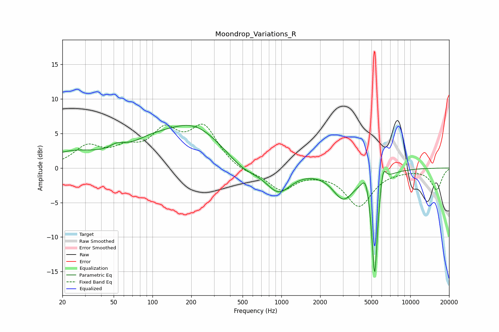

# Moondrop_Variations_R
See [usage instructions](https://github.com/jaakkopasanen/AutoEq#usage) for more options and info.

### Parametric EQs
Apply preamp of -6.3 dB when using parametric equalizer.

|   # | Type    |   Fc (Hz) |    Q |   Gain (dB) |
|-----|---------|-----------|------|-------------|
|   1 | Peaking |        24 | 0.7  |         2.1 |
|   2 | Peaking |        53 | 2.26 |         1   |
|   3 | Peaking |        97 | 0.85 |         1.8 |
|   4 | Peaking |       210 | 0.61 |         5.7 |
|   5 | Peaking |       502 | 1.12 |        -1.7 |
|   6 | Peaking |       950 | 1.46 |        -3.6 |
|   7 | Peaking |      3025 | 1.69 |        -4.1 |
|   8 | Peaking |      4512 | 4.93 |         2.3 |
|   9 | Peaking |      5290 | 6    |       -15.8 |
|  10 | Peaking |      6134 | 5.89 |         3.3 |

### Fixed Band EQs
When using fixed band (also called graphic) equalizer, apply preamp of **-6.4 dB** (if available) and set gains manually with these parameters.

|   # | Type    |   Fc (Hz) |    Q |   Gain (dB) |
|-----|---------|-----------|------|-------------|
|   1 | Peaking |        31 | 1.41 |         2.8 |
|   2 | Peaking |        62 | 1.41 |         2.1 |
|   3 | Peaking |       125 | 1.41 |         4.7 |
|   4 | Peaking |       250 | 1.41 |         5.6 |
|   5 | Peaking |       500 | 1.41 |        -0.7 |
|   6 | Peaking |      1000 | 1.41 |        -3.1 |
|   7 | Peaking |      2000 | 1.41 |        -0.3 |
|   8 | Peaking |      4000 | 1.41 |        -5.4 |
|   9 | Peaking |      8000 | 1.41 |        -0.2 |
|  10 | Peaking |     16000 | 1.41 |        -3.1 |

### Graphs

