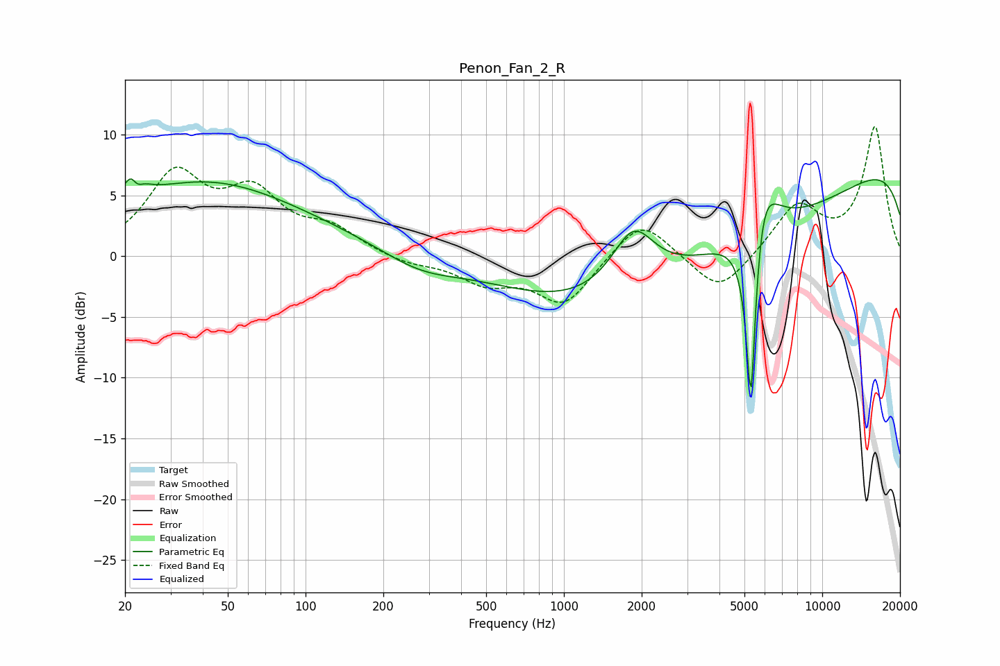

# Penon_Fan_2_R
See [usage instructions](https://github.com/jaakkopasanen/AutoEq#usage) for more options and info.

### Parametric EQs
Apply preamp of -6.4 dB when using parametric equalizer.

|   # | Type    |   Fc (Hz) |    Q |   Gain (dB) |
|-----|---------|-----------|------|-------------|
|   1 | Peaking |        22 | 4.4  |         4.3 |
|   2 | Peaking |        22 | 5.84 |        -2.9 |
|   3 | Peaking |        38 | 0.4  |         5.4 |
|   4 | Peaking |       131 | 0.26 |         1.2 |
|   5 | Peaking |       276 | 0.89 |        -1.7 |
|   6 | Peaking |      1855 | 1.67 |         5   |
|   7 | Peaking |      3666 | 0.18 |        -8.3 |
|   8 | Peaking |      5298 | 6    |       -18.6 |
|   9 | Peaking |      5779 | 2.43 |         7.2 |
|  10 | Peaking |     10000 | 0.18 |        10.6 |

### Fixed Band EQs
When using fixed band (also called graphic) equalizer, apply preamp of **-10.7 dB** (if available) and set gains manually with these parameters.

|   # | Type    |   Fc (Hz) |    Q |   Gain (dB) |
|-----|---------|-----------|------|-------------|
|   1 | Peaking |        31 | 1.41 |         6.4 |
|   2 | Peaking |        62 | 1.41 |         4.6 |
|   3 | Peaking |       125 | 1.41 |         1.9 |
|   4 | Peaking |       250 | 1.41 |        -0.6 |
|   5 | Peaking |       500 | 1.41 |        -2   |
|   6 | Peaking |      1000 | 1.41 |        -3.9 |
|   7 | Peaking |      2000 | 1.41 |         3.3 |
|   8 | Peaking |      4000 | 1.41 |        -3.3 |
|   9 | Peaking |      8000 | 1.41 |         4.1 |
|  10 | Peaking |     16000 | 1.41 |        10.5 |

### Graphs

