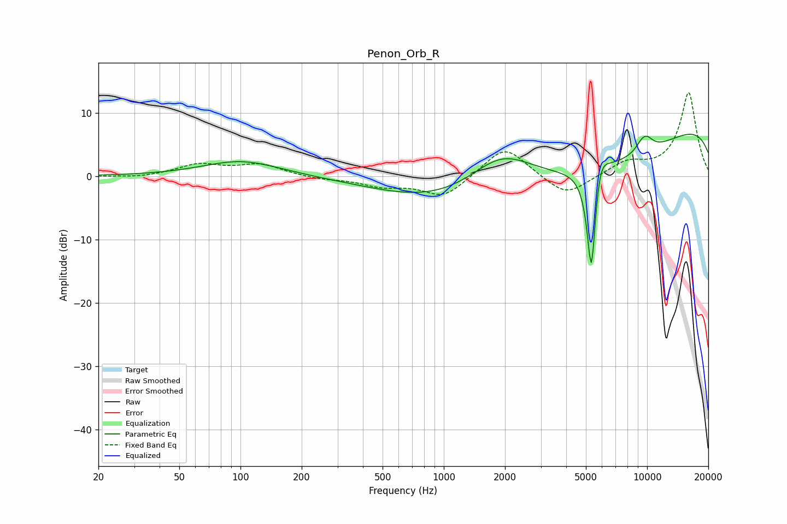

# Penon_Orb_R
See [usage instructions](https://github.com/jaakkopasanen/AutoEq#usage) for more options and info.

### Parametric EQs
Apply preamp of -6.7 dB when using parametric equalizer.

|   # | Type    |   Fc (Hz) |    Q |   Gain (dB) |
|-----|---------|-----------|------|-------------|
|   1 | Peaking |       101 | 0.75 |         2.5 |
|   2 | Peaking |      1914 | 0.79 |         7.5 |
|   3 | Peaking |      3427 | 0.19 |        -1.9 |
|   4 | Peaking |      3577 | 0.19 |        -8.8 |
|   5 | Peaking |      5322 | 6    |        -3.2 |
|   6 | Peaking |      5324 | 6    |       -15.4 |
|   7 | Peaking |      5815 | 3.68 |         5.1 |
|   8 | Peaking |      9430 | 3.82 |         1.3 |
|   9 | Peaking |     10000 | 3.59 |         1.5 |
|  10 | Peaking |     10000 | 0.18 |        11.5 |

### Fixed Band EQs
When using fixed band (also called graphic) equalizer, apply preamp of **-13.3 dB** (if available) and set gains manually with these parameters.

|   # | Type    |   Fc (Hz) |    Q |   Gain (dB) |
|-----|---------|-----------|------|-------------|
|   1 | Peaking |        31 | 1.41 |        -0.3 |
|   2 | Peaking |        62 | 1.41 |         1.8 |
|   3 | Peaking |       125 | 1.41 |         1.8 |
|   4 | Peaking |       250 | 1.41 |        -0.5 |
|   5 | Peaking |       500 | 1.41 |        -1.4 |
|   6 | Peaking |      1000 | 1.41 |        -3.4 |
|   7 | Peaking |      2000 | 1.41 |         5   |
|   8 | Peaking |      4000 | 1.41 |        -3.4 |
|   9 | Peaking |      8000 | 1.41 |         2   |
|  10 | Peaking |     16000 | 1.41 |        13.2 |

### Graphs

